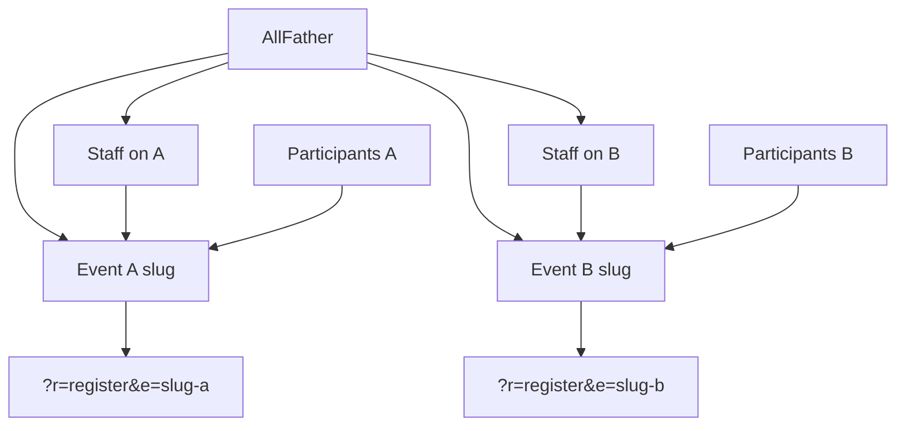

# Multi-event All Father platform

Turn the current single-active-event app into a multi-event platform: an All Father account creates events, assigns people and roles per event, and each event gets its own public register/scan links while keeping today's attendance capabilities.

**Implement in OpenCode with Muse Spark 13, enforcing [taste-skill](https://github.com/leonxlnx/taste-skill) and [ponytail](https://github.com/dietrichgebert/ponytail), on remote branch `attendance_accend`.**

**Audit date:** 2026-09-14. Core multi-event draft exists in the **local working tree**. It is **not** a finished implementation. `Plan.md` checkboxes below are the honest status.

---

## Agent: start here

You are closing gaps on branch `attendance_accend`. Do not rebuild the multi-event platform. Reuse `EventContext`, `AuthService`, and `?r=` routes.

**Session contract**

1. You are on branch `attendance_accend`.
2. Load ponytail (`full`) and taste-skill (`design-taste-frontend` + `redesign-existing-projects`) before writing files.
3. State a one-line design read before any view/CSS change. Public-sector / trust-first. Dials: `DESIGN_VARIANCE: 3-4`, `MOTION_INTENSITY: 2-3`, `VISUAL_DENSITY: 5` (admin), `4` (public register/scan).
4. No new frontend stack. No extra tables unless a remaining item below requires it.
5. Do not commit `.env`, `.env.vps`, `storage/` uploads, or graphify cache.

**First commands**

```bash
git checkout attendance_accend
git status
# Confirm local uncommitted multi-event files are present (EventContext.php, migrations/009_multi_event.sql, etc.)
# If the tree is clean and those files are missing, the draft was never committed. Recover from the machine that audited this plan.
```

Then work the **Remaining work** list in order. After each item, tick it here.

---

## Checklist

- [x] Create and push remote branch `attendance_accend` from `main`
- [ ] Commit and push the local multi-event draft (currently only `Plan.md` is on origin)
- [ ] Wire OpenCode skills for real (taste-skill files missing; ponytail is only a plugin line)
- [x] Draft `009_multi_event` + `EventContext` + backfill (local; harden schema leftovers below)
- [x] Draft unique links `e=slug` + picker + All Father copy buttons (local)
- [ ] `event_admin` can see/copy unique links (All Father only today)
- [x] Draft event switcher + scoped lists/import/export/report/gallery/SEO (local)
- [ ] Enforce schedule (`starts_at` / `ends_at`) on public register/scan
- [ ] Fix event Save wiping schedule fields
- [ ] Tighten `requireAdmin()` and stop Router fail-open
- [ ] Require event slug on participant lookup API
- [ ] Schema leftovers: NOT NULL `event_id`, attendance unique key, drop `setActive`, stop SEO NULL bleed
- [ ] Tests that hit controllers (not only SQL / remapped session)
- [ ] Taste-skill audit-first restyle of register/scan/events/switcher
- [ ] `/ponytail-review` then commit remaining work to `attendance_accend`

---

## Current draft (already written, local)

These exist in the working tree. Do not rewrite them unless fixing a gap below.

| Area | Where |
|------|--------|
| Migration + backfill | [`migrations/009_multi_event.sql`](migrations/009_multi_event.sql), applied via [`Database::migrate()`](src/Services/Database.php) |
| Event resolver | [`src/Services/EventContext.php`](src/Services/EventContext.php) |
| Public register/scan/submit | [`RegisterController`](src/Controllers/RegisterController.php), [`ScanController`](src/Controllers/ScanController.php), [`AttendanceController`](src/Controllers/AttendanceController.php), [`views/public_event_picker.php`](views/public_event_picker.php) |
| Router `event:` guards | [`config/routes.php`](config/routes.php), [`src/Core/Router.php`](src/Core/Router.php) |
| All Father events + assign | [`AdminEventsController`](src/Controllers/AdminEventsController.php), [`views/admin_events.php`](views/admin_events.php) |
| Admin switcher | [`views/partials/admin_nav.php`](views/partials/admin_nav.php) `admin_events_switch` |
| Scoped admin lists | Registrants, attendance, import, export, report, gallery, SEO controllers |
| Settings / users / logs | Still `role:admin` (All Father only) |
| Smoke tests | [`scripts/test_rbac_matrix.php`](scripts/test_rbac_matrix.php) last run: **45 passed, 0 failed** (2026-09-14) |
| OpenCode stub | [`opencode.json`](opencode.json) has `"plugin": ["@dietrichgebert/ponytail"]`; [`AGENTS.md`](AGENTS.md) repeats the contract |

**Remote:** `origin/attendance_accend` still has only commit `Add multi-event All Father plan for OpenCode.` Feature files are uncommitted locally.

---

## Remaining work (close the gap)

Do these in order. Each item is concrete.

### 1. Ship the draft so the other clone can see it

- Stage only app source: migration, `EventContext`, controllers, views, `opencode.json`, `AGENTS.md`, `Plan.md`, test scripts.
- Do **not** stage `.env`, `.env.vps`, `storage/qrcodes/**`, `storage/signatures/**`, `graphify-out/cache/**`.
- Commit on `attendance_accend` and `git push origin attendance_accend`.
- Author: `JE Lite <jaymar.recolizado@dict.gov.ph>` if the environment has no git identity. Do not run `git config`.

### 2. Install skills into this repo

Taste-skill is **not** in the tree (no `skills/` / `.agents/` copies).

```bash
npx skills add https://github.com/Leonxlnx/taste-skill --skill "design-taste-frontend"
npx skills add https://github.com/Leonxlnx/taste-skill --skill "redesign-existing-projects"
```

Confirm ponytail actually loads in OpenCode (`@dietrichgebert/ponytail`). Keep [`AGENTS.md`](AGENTS.md).

### 3. `event_admin` unique links

Plan: All Father **and** `event_admin` see copy buttons for register/scan.

Today: [`admin_events`](config/routes.php) is `role:admin` only. Nav hides Events from `event_admin`.

Minimum: let `event_admin` open a read-only (or links-only) view of **their assigned event** with the same copy buttons from `EventContext::publicLinks($slug)`. They must not create events, assign staff, or see other events.

### 4. Enforce schedule on public pages

[`EventContext::isPublicOpen()`](src/Services/EventContext.php) only checks `status === 'open'`.

Also require:

- `status === 'open'`
- if `starts_at` is set, now >= starts_at
- if `ends_at` is set, now <= ends_at

Use this in register show/submit, scan show, attendance submit. Keep timezone consistent with the app (server local / PHP `date()` as used today).

### 5. Event Save must not wipe schedule

[`views/admin_events.php`](views/admin_events.php) row Save posts status only. [`AdminEventsController::update()`](src/Controllers/AdminEventsController.php) writes `starts_at`/`ends_at` from POST, so they become empty.

Fix: include `starts_at` and `ends_at` on the Save form (pre-filled), or omit those columns from UPDATE when not posted.

### 6. Auth tightening

- Replace leftover `requireAdmin()` that only checks `$_SESSION['admin_id']` in registrants/attendance/import/export/report/signature. Use `AuthService::check()` plus `EventContext::canAccess` (already partly duplicated as `currentEventOrDeny`). One helper, not two weak layers.
- [`Router.php`](src/Core/Router.php) `event:` guard **fails open** on exception (`catch` continues). Fail closed: deny unless All Father and the only goal is creating the first event.
- Remove or no-op document [`admin_events_set_active`](config/routes.php); [`setActive()`](src/Controllers/AdminEventsController.php) is a leftover singleton switch.

### 7. Participant API must require the event

[`ParticipantController::getByUuidJson()`](src/Controllers/ParticipantController.php) only filters by event when `e` is present. Direct `?r=api_participant&uuid=` returns any event's person.

Require `e` (or session `scan_event_id` from the kiosk). If missing or uuid belongs to another event, 404. Scan JS already sends `e` ([`views/scan.php`](views/scan.php)).

### 8. Schema leftovers (small follow-up migration, e.g. `010`)

[`009_multi_event.sql`](migrations/009_multi_event.sql) is a draft:

- `participants.event_id` is still nullable. After backfill, set NOT NULL (only if no nulls remain).
- Add `UNIQUE (participant_id, event_id, attendance_date)` if enforce-single is the default (app already checks; unique key is the plan).
- [`AdminSeoController`](src/Controllers/AdminSeoController.php) still uses `a.event_id = ? OR a.event_id IS NULL`. After backfill, drop the `IS NULL` so old rows do not appear on every event.

Make the follow-up idempotent the same way `009` is (`executeSqlFileTolerant`).

### 9. Tests that match the plan

[`scripts/test_rbac_matrix.php`](scripts/test_rbac_matrix.php) is necessary but not sufficient.

Add (keep it CLI, no new framework):

- `event_admin` assignment in the matrix (create a user, assign `event_admin` on A only).
- Forced context: staff assigned to A, session `current_event_id` forced to B, router/controller must deny (today `currentEvent()` silently remaps to an assigned event, so isolation tests can pass for the wrong reason).
- Call `AttendanceController::submitJsonForTest` with Event A uuid + Event B slug; expect `not_found`.
- Call participant lookup without `e` after item 7; expect missing/404.
- Open event with future `starts_at`; `isPublicOpen` is false after item 4.

Run: `php scripts/test_rbac_matrix.php`

### 10. Taste-skill restyle (after behavior is correct)

Audit-first on existing views only:

- [`views/register.php`](views/register.php), [`views/scan.php`](views/scan.php), [`views/public_event_picker.php`](views/public_event_picker.php)
- [`views/admin_events.php`](views/admin_events.php), [`views/partials/admin_nav.php`](views/partials/admin_nav.php)

Keep Bootstrap + [`assets/app.css`](assets/app.css). Institutional, not marketing. No em dashes in UI copy.

### 11. Review and push

`/ponytail-review`, then commit and push to `attendance_accend`.

---

## Target model (unchanged)

All Father can do everything on every event, plus create events and assign staff. Event staff only see their assigned event and role.



**Assumptions**

- Same email **may** register on different events (blocked only **inside** one event).
- Staff accounts are **global logins**, assigned to one or more events (one role per event).
- Public scan stays a kiosk: opening that event's scan link is enough, but the link is event-specific.
- Existing production rows become **Event 1** so current data is not dropped.

| Who | Can do |
|-----|--------|
| **All Father** (`admins.role = admin`) | Create/edit/close events, assign staff, global users, SMTP/settings, every current capability on **any** event |
| **event_admin** (assignment) | Ops on **that event only**: registrants, VIP, import/export, reports, gallery, scan, unique links — not settings, not users, not other events |
| **checker** (assignment) | Registrants + attendance + scan on assigned event |
| **seo_viewer** (assignment) | SEO dashboard for assigned event only |

Public links stay query-string: `/?r=register&e={slug}`, `/?r=scan&e={slug}`.

---

## Out of scope (unless you ask)

- Pretty paths like `/e/slug/register`
- Shared people directory (one profile, many events)
- SSO / per-agency tenancy
- Deploying this to the VPS
- Rebuilding EventContext or a new SPA
