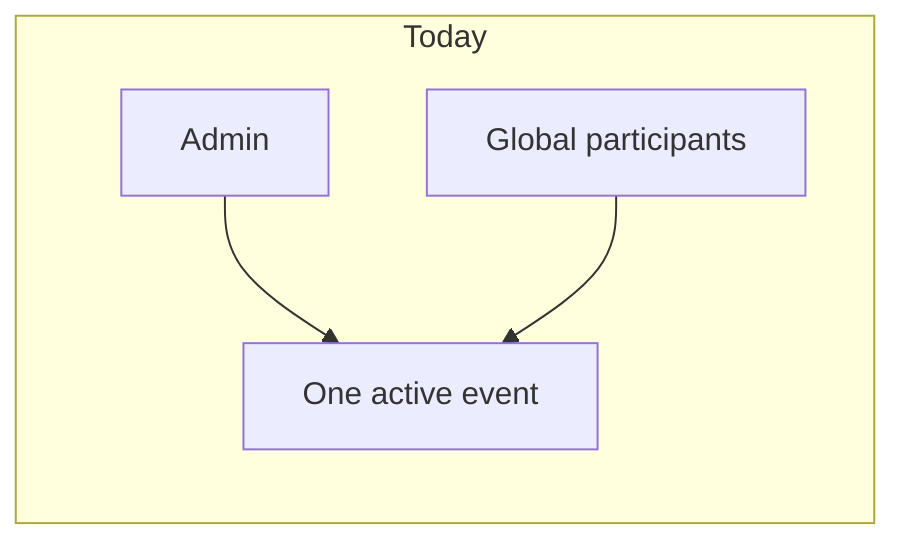
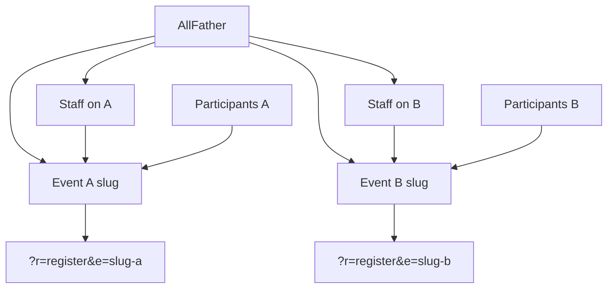

# Multi-event All Father platform

Turn the current single-active-event app into a multi-event platform: an All Father account creates events, assigns people and roles per event, and each event gets its own public register/scan links while keeping today's attendance capabilities.

**Implement in OpenCode with Muse Spark 13, enforcing [taste-skill](https://github.com/leonxlnx/taste-skill) and [ponytail](https://github.com/dietrichgebert/ponytail), on remote branch `attendance_accend`.**

## Checklist

- [x] Create and push remote branch `attendance_accend` from `main`
- [ ] Wire OpenCode (Muse Spark 13) to enforce ponytail + taste-skill (`design-taste-frontend` + `redesign-existing-projects`)
- [ ] Add `009_multi_event` migration (slug, schedule, status, `participants.event_id`, `event_assignments`) and `EventContext` resolver; backfill existing rows to Event 1
- [ ] Require `e=slug` on register/scan/QR/attendance; copyable unique links; reject cross-event QR
- [ ] Event switcher + filter registrants/attendance/import/export/reports/SEO/gallery by current event; replace Set Active
- [ ] All Father assignment UI; `event_admin` / `checker` / `seo_viewer` scoped to assigned events; tighten `requireAdmin()`
- [ ] Extend RBAC/event tests: two concurrent events, email uniqueness per event, staff isolation, cross-event scan deny

---

## What exists today

The install is one live event at a time.

- [`migrations/003_events.sql`](migrations/003_events.sql) has `events.active`. [`AdminEventsController::setActive()`](src/Controllers/AdminEventsController.php) zeros every row, then sets one `active=1`.
- Public register/scan URLs have **no event key** (`?r=register`, `?r=scan` in [`config/routes.php`](config/routes.php)). Check-in always stamps the singleton active event.
- **Participants are global** (`UNIQUE(email)` in [`migrations/001_init.sql`](migrations/001_init.sql)). The same email cannot belong to two events. Attendance has `event_id`, but registrants, import, export, and QR do not.
- Staff roles in `admins.role` (`admin`, `checker`, `seo_viewer`) are **global**. There is no event assignment. All Father is effectively today's `admin`.



## Target model

All Father can do everything on every event, plus create events and assign staff. Event staff only see their assigned event and role.



**Assumptions**

- Same email **may** register on different events (blocked only **inside** one event).
- Staff accounts are **global logins**, assigned to one or more events (one role per event).
- Public scan stays a kiosk: opening that event's scan link is enough (same as today), but the link is event-specific.
- Existing production rows become **Event 1** so current data is not dropped.

---

## 0. Branch, OpenCode, and required skills

Implementation happens in **OpenCode** with model **Muse Spark 13** (`muse spark.13`). Do not start feature work on `main`.

### Remote branch (first action)

From a clean checkout of [jaymarrecolizado-tech/attendance_dghero](https://github.com/jaymarrecolizado-tech/attendance_dghero):

```bash
git checkout main
git pull origin main
git checkout -b attendance_accend
git push -u origin attendance_accend
```

All commits for this work stay on `attendance_accend`. Branch name is exactly `attendance_accend`.

### Enforce these two skills every OpenCode session

Both are mandatory. Install them into **this repo** so Muse Spark 13 cannot skip them.

**1. Ponytail** — [dietrichgebert/ponytail](https://github.com/dietrichgebert/ponytail)

- OpenCode plugin in project `opencode.json` (create if missing):

```json
{
  "plugin": ["@dietrichgebert/ponytail"]
}
```

- Default mode `full` (`PONYTAIL_DEFAULT_MODE=full` or ponytail config).
- Ladder: skip if YAGNI, reuse existing PHP/services/views, no new framework, no extra tables/files unless this plan needs them. Never drop validation, CSRF, auth, or accessibility.
- After non-trivial diffs, run `/ponytail-review` and delete over-build.

**2. Taste Skill** — [leonxlnx/taste-skill](https://github.com/leonxlnx/taste-skill)

```bash
npx skills add https://github.com/Leonxlnx/taste-skill --skill "design-taste-frontend"
npx skills add https://github.com/Leonxlnx/taste-skill --skill "redesign-existing-projects"
```

- This is an **existing public-sector attendance app**, not a greenfield landing page.
- **Every UI change is audit-first** (`redesign-existing-projects`): read current register/scan/admin CSS and views, keep working flows, then restyle.
- **`design-taste-frontend` design read** for this product: public-sector event registration for government attendees; trust-first; no AI-purple / Inter-slate defaults.
- Dial preset (public-sector / preserve structure): `DESIGN_VARIANCE: 3-4`, `MOTION_INTENSITY: 2-3`, `VISUAL_DENSITY: 5` on admin lists; public register/scan can be slightly airier (`DENSITY: 4`) but stay institutional, not marketing.
- No em dashes in UI copy. No half-finished views.

**How they split work**

- Ponytail owns PHP, SQL, routing, auth, and "don't invent a new architecture."
- Taste + redesign own HTML/CSS/admin chrome, event switcher, unique-link page, and public register/scan — still inside existing `views/` + `assets/`, not a new SPA.

**Session contract (paste at the start of every OpenCode / Muse Spark 13 thread)**

1. You are on branch `attendance_accend`.
2. Load ponytail (`full`) and taste-skill (`design-taste-frontend` + `redesign-existing-projects`) before writing files.
3. State a one-line design read before any view/CSS change.
4. Reuse `EventContext`, `AuthService`, and current `?r=` routes; do not add a new frontend stack.

Optional: add a short `AGENTS.md` that repeats this contract so OpenCode auto-loads it.

---

## 1. Data model

New migration (e.g. [`migrations/009_multi_event.sql`](migrations/009_multi_event.sql)):

**`events`** — stop using a single `active` switch.

- `slug` unique (used in public links)
- `status`: `draft` | `open` | `closed`
- `starts_at`, `ends_at` (nullable; used for schedule and listing)
- Keep `enforce_single_time_in`
- Keep `active` only as a backfill flag, then stop writing it

**`participants`** — become event-owned.

- Add `event_id` (required after backfill)
- Replace `UNIQUE(email)` with `UNIQUE(event_id, email)`
- Keep global unique `uuid` so QR URLs stay `qrcode.php?uuid=...`

**`attendance`** — require `event_id`, add FK to `events`, unique `(participant_id, event_id, attendance_date)` when enforce-single is on (app already checks this).

**`event_assignments`** — delegation table.

- `admin_id`, `event_id`, `role` (`event_admin` | `checker` | `seo_viewer`)
- `UNIQUE(admin_id, event_id)`

**`admins`** — keep `role='admin'` as **All Father**. Do not put per-event roles on `admins.role`. Existing `checker` / `seo_viewer` accounts are migrated onto assignments for the current active event.

Backfill: create a slug for the current active event (or first event), set all existing participants + null attendance to that `event_id`, assign existing non-admin staff to it.

---

## 2. Event context (replace `WHERE active=1`)

Add one resolver, e.g. [`src/Services/EventContext.php`](src/Services/EventContext.php), and delete the duplicated `SELECT ... WHERE active=1 LIMIT 1` in:

- [`AttendanceController.php`](src/Controllers/AttendanceController.php)
- [`AdminAttendanceController.php`](src/Controllers/AdminAttendanceController.php)
- [`AdminSeoController.php`](src/Controllers/AdminSeoController.php)
- [`AdminSignatureController.php`](src/Controllers/AdminSignatureController.php)

**Public pages:** event comes from `e={slug}` (required). Register/scan/submit refuse a missing, draft, or closed event.

**Admin:** All Father picks an event (session `current_event_id`). Staff with one assignment land on that event; staff with several get a switcher. Every registrant/attendance/import/export/report/gallery/SEO query is filtered by that `event_id`. All Father can switch to any event.

---

## 3. Unique public links

Keep the existing `?r=` router (no Apache rewrite required).

| Purpose | Link |
|---------|------|
| Register | `/?r=register&e={slug}` |
| Scan / kiosk | `/?r=scan&e={slug}` |

All Father (and `event_admin`) see copy buttons for both links on the event page. QR payload stays `PART|{uuid}`; lookup becomes **uuid + this event**. A QR from Event A must not check in on Event B.

Default `/?r=register` with no `e` shows an event picker of **open** events (or a short "pick your event" list), so old bookmarks do not silently hit the wrong event.

---

## 4. Auth and roles

Reuse [`AuthService`](src/Services/AuthService.php) + router guards; add event checks.

| Who | Can do |
|-----|--------|
| **All Father** (`admins.role = admin`) | Create/edit/close events, assign staff, global users, SMTP/settings, and every current capability on **any** event |
| **event_admin** (assignment) | Current admin ops **on that event only**: registrants, VIP, import/export, reports, gallery, scan — not settings, not users, not other events |
| **checker** (assignment) | Same as today: registrants + attendance + scan on assigned event |
| **seo_viewer** (assignment) | SEO dashboard for assigned event only |

New All Father UI:

- Event list with schedule/status, create/edit, unique links
- Assign / remove people on an event (existing accounts or create staff then assign)
- Event switcher in [`views/partials/admin_nav.php`](views/partials/admin_nav.php)

Replace "Set Active" in [`views/admin_events.php`](views/admin_events.php) with status + schedule + links + assignments.

Tighten weak `requireAdmin()` (session id only) in event/attendance controllers so All Father vs event staff is actually enforced.

---

## 5. Keep current capabilities (per event)

No new product surface except events + assignments. These stay, scoped to the current event:

- Registration, QR generate/email, VIP
- Scan, signature, present/absent, gallery
- CSV import/export, reports
- SEO dashboard
- Action logs (tag `event_id` when the action is event-scoped)

SMTP and global user CRUD stay All Father only.

---

## 6. Implementation order

0. **Branch + OpenCode skills** — create/push `attendance_accend`; add `opencode.json` (ponytail plugin), install taste-skill + redesign-existing-projects, optional `AGENTS.md`. Confirm Muse Spark 13 is the session model.
1. **Migration + backfill** + `EventContext` so old data still works as one event (ponytail: one resolver, no extra service layer).
2. **Public unique links** — register/scan/submit/QR require `e=slug`; restyle those views with taste-skill (audit-first).
3. **Admin scoping** — filter all lists/exports by `current_event_id`; event switcher; drop singleton Set Active.
4. **Assignments + All Father UI** — create staff, assign roles, hide other events from staff; new event/assignment screens follow the public-sector dials.
5. **Tests** (PHP, existing style): `scripts/test_rbac_matrix.php` plus new cases for two open events (separate emails, cross-event QR reject, staff cannot open Event B). `/ponytail-review` before merge.

---

## Out of scope (unless you ask)

- Pretty paths like `/e/slug/register`
- Shared people directory (one profile, many events)
- SSO / per-agency tenancy (already out of [`TODORBAC/rbac_security_spec.md`](TODORBAC/rbac_security_spec.md))
- Deploying this to the VPS
