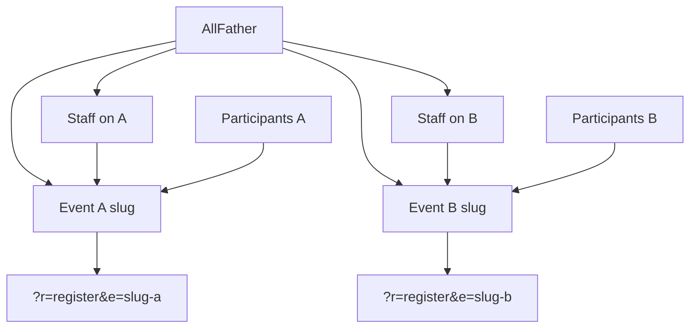

# Multi-event All Father platform

Turn the app into a multi-event platform: All Father creates events, assigns people and roles per event, each event has unique register/scan links, current attendance capabilities stay.

**OpenCode + Muse Spark 13** on branch `attendance_accend`. Enforce [ponytail](https://github.com/dietrichgebert/ponytail) and [taste-skill](https://github.com/leonxlnx/taste-skill) (`design-taste-frontend` + `redesign-existing-projects`).

**Audit:** 2026-09-14 (second pass). Platform **behavior is implemented and pushed**. Remaining work is leftovers only. Do not rebuild EventContext or the multi-event model.

Remote: `origin/attendance_accend` at `3d1ec25` (`Finish multi-event platform…`). Tests: `php scripts/test_rbac_matrix.php` → **61 passed, 0 failed**.

---

## Agent: start here

You are closing **four leftovers** on `attendance_accend`. Reuse `EventContext`, `AuthService`, and `?r=` routes. No new SPA, no extra tables unless a leftover below needs a tiny ALTER.

**Session contract**

1. Branch is `attendance_accend`.
2. Load ponytail (`full`) and taste-skill before writing files. Skills live in [`.agents/skills/`](.agents/skills/).
3. Design read before any CSS/view change: public-sector event registration, trust-first. Dials: `DESIGN_VARIANCE: 3-4`, `MOTION_INTENSITY: 2-3`, `VISUAL_DENSITY: 5` (admin), `4` (public). **Do not keep Inter + purple gradient** (`#5c6cf2` in [`assets/app.css`](assets/app.css) is the AI default taste-skill forbids).
4. Do not commit `.env`, `.env.vps`, `storage/` uploads, `graphify-out/cache`, or extra skill copies under `.claude/skills/` or `agent/`.

```bash
git checkout attendance_accend
git pull origin attendance_accend
php scripts/test_rbac_matrix.php
```

Work the **Remaining leftovers** list in order. Tick items here when done. Re-run the test script after 1–3.

---

## Checklist

Shipped:

- [x] Branch `attendance_accend` created and pushed
- [x] Multi-event draft committed (`c619ef0`) and finish commit pushed (`3d1ec25`)
- [x] Ponytail in [`opencode.json`](opencode.json); taste-skill copies in [`.agents/skills/`](.agents/skills/) + [`skills-lock.json`](skills-lock.json)
- [x] `009` + `010` migrations, [`EventContext`](src/Services/EventContext.php), backfill
- [x] Unique links `e=slug`, public picker, All Father copy buttons
- [x] `event_admin` links page [`admin_event_links`](views/admin_event_links.php)
- [x] Event switcher + scoped registrants/attendance/import/export/report/gallery/SEO
- [x] Schedule window in `isPublicOpen()` (status + `starts_at` / `ends_at`)
- [x] Event Save keeps schedule fields (`datetime-local` + `normDt()`)
- [x] Router `event:` guard fails closed
- [x] Participant lookup requires `e` (or kiosk `scan_event_id`)
- [x] Controller tests: `event_admin` matrix, cross-event submit, lookup without `e`, schedule window
- [x] SEO queries dropped `event_id IS NULL`

Still open:

- [x] Taste-skill audit-first restyle (register/scan/events/switcher) — Inter + purple replaced with Public Sans + federal navy (`#1a4480` / `#162e51`), flat surfaces, solid navbar, de-glassed panels
- [x] Drop `event_id IS NULL` bleed in attendance KPI/list queries
- [x] Collapse leftover `requireAdmin()` into one auth+event helper ([`ResolvesEventContext`](src/Controllers/Concerns/ResolvesEventContext.php) trait, 9 controllers)
- [x] (Optional) Hard-deny forced `current_event_id` for an unassigned event instead of remapping

---

## What is already shipped (do not rewrite)

| Area | Where |
|------|--------|
| Migrations | [`migrations/009_multi_event.sql`](migrations/009_multi_event.sql), [`migrations/010_multi_event_hardening.sql`](migrations/010_multi_event_hardening.sql), [`Database::migrate010()`](src/Services/Database.php) |
| Event resolver | [`src/Services/EventContext.php`](src/Services/EventContext.php) |
| Public flows | [`RegisterController`](src/Controllers/RegisterController.php), [`ScanController`](src/Controllers/ScanController.php), [`AttendanceController`](src/Controllers/AttendanceController.php), [`views/public_event_picker.php`](views/public_event_picker.php) |
| Guards | [`config/routes.php`](config/routes.php) `event:…`, [`Router.php`](src/Core/Router.php) fail-closed |
| All Father events | [`AdminEventsController`](src/Controllers/AdminEventsController.php), [`views/admin_events.php`](views/admin_events.php) |
| Event admin links | [`views/admin_event_links.php`](views/admin_event_links.php), route `admin_event_links` (`event:event_admin`) |
| Switcher | [`views/partials/admin_nav.php`](views/partials/admin_nav.php) |
| Lookup API | [`ParticipantController`](src/Controllers/ParticipantController.php) requires `e` |
| Tests | [`scripts/test_rbac_matrix.php`](scripts/test_rbac_matrix.php) |

Roles (unchanged target): All Father = `admins.role = admin`. Per-event `event_admin` / `checker` / `seo_viewer` live on `event_assignments`. Settings, users, logs stay All Father only.

---

## Remaining leftovers

### 1. Taste-skill restyle (required)

Audit-first on existing views. Keep Bootstrap + [`assets/app.css`](assets/app.css). No new framework.

**Problem:** CSS is still Inter + purple mesh (`--brand-primary: #5c6cf2`). That is the taste-skill anti-pattern. Nav got quieter links only.

Restyle:

- [`assets/app.css`](assets/app.css)
- [`views/register.php`](views/register.php), [`views/scan.php`](views/scan.php), [`views/public_event_picker.php`](views/public_event_picker.php)
- [`views/admin_events.php`](views/admin_events.php), [`views/admin_event_links.php`](views/admin_event_links.php), [`views/partials/admin_nav.php`](views/partials/admin_nav.php)

Public-sector / government attendees. Institutional, not marketing. No em dashes in UI copy.

### 2. Attendance `IS NULL` bleed (required)

SEO was fixed. Attendance was not.

[`AdminAttendanceController.php`](src/Controllers/AdminAttendanceController.php) still has `a.event_id = ? OR a.event_id IS NULL` (and similar) around lines 51, 174, 186, 220, 407.

After `009` backfill, NULL attendance should not appear on every event. Use `a.event_id = ?` / `event_id = ?` only, same as SEO.

### 3. One auth helper (required, small)

Several controllers still have `requireAdmin()` plus `currentEventOrDeny()` / inline `canAccess`.

`requireAdmin()` now uses `AuthService::check()` (better than raw `$_SESSION['admin_id']`), but the plan asked for **one** helper: logged in + `EventContext::canAccess` for the current event.

Reuse the existing `currentEventOrDeny` pattern. Do not add a new service class.

### 4. Forced event context (optional)

Today, staff assigned only to Event A with session `current_event_id` = B **remap** to A. `canAccess(B)` is false, so they cannot read B. Tests encode this remap.

If you change it: deny (403) when the session event is not assigned, instead of silently switching. Update the remap assertions in [`scripts/test_rbac_matrix.php`](scripts/test_rbac_matrix.php). Skip if you are only doing 1–3.

### 5. After leftovers

`php scripts/test_rbac_matrix.php` must stay green. `/ponytail-review`. Commit and push to `attendance_accend`. Author `JE Lite <jaymar.recolizado@dict.gov.ph>` if the shell has no git identity; do not run `git config`.

---

## Target model (unchanged)



Public links: `/?r=register&e={slug}`, `/?r=scan&e={slug}`.

---

## Out of scope

- Pretty paths like `/e/slug/register`
- Shared people directory
- SSO / per-agency tenancy
- VPS deploy
- Rebuilding EventContext
- Committing `.env.vps`, storage uploads, or duplicate skill folders (`.claude/skills/`, `agent/`)
