# Multi-event All Father platform

Turn the app into a multi-event platform: All Father creates events, assigns people and roles per event, each event has unique register/scan links, current attendance capabilities stay.

**Status:** Multi-event is shipped. VPS is live. **Plan#4** through **Plan#14** are on production as of 2026-09-23. **Plan#15** (required sex, email, contact number; Register active only when complete) is implemented and browser-verified on the local copy (2026-09-23); the operator still needs to overlay the touched files on digitalhero. Current branch is `9232026_ultra`.

**Audit:** 2026-09-14 closed multi-event leftovers. 2026-09-20 landed Settings merge, script gating, AuthService, flash plumbing, `env.example`. 2026-09-21 morning pass fixed door-scan CSRF, import-preview rotate, retry `e=` link, event-aware nav, main deploy docs. Same-day afternoon pass closed the five re-check nits (below).

---

## Current state

Multi-event is shipped. Plan#4 through Plan#14 are on digitalhero, including the Hostinger cron for [`scripts/coa_process_scheduled.php`](scripts/coa_process_scheduled.php). **Plan#15 is done locally (2026-09-23):** sex, email, and contact number are required end to end, Register is visible but muted until the whole form is valid and the email is free, and the no-JS fallback Register no longer doubles as an active button. Do not rebuild EventContext. Do not commit `.env` or `.env.vps`.

**Plan numbers**

| ID | Plan | State |
|----|------|--------|
| Plan#1 | Multi-event All Father | Done |
| Plan#2 | Production hardening, guest polish, deploy docs | Done |
| Plan#3 | VPS go-live | Live; operator smoke still open |
| Plan#4 | Per-event registration branding | Done (code + browser-verified 2026-09-22) |
| Plan#5 | Hack for Gov 5 door gate | Live on digitalhero.dictr2.cloud |
| Plan#6 | Door reveal and window particles | Live on digitalhero.dictr2.cloud |
| Plan#7 | Hack for Gov mark and circuits on the form | Live on digitalhero.dictr2.cloud |
| Plan#8 | Moving circuit background on the register page | Live on digitalhero.dictr2.cloud |
| Plan#9 | Richer door unlock animation | Live on digitalhero.dictr2.cloud |
| Plan#10 | Restore Certificate of Appearance (auto-create + auto-send) | Live on digitalhero.dictr2.cloud; enable per event |
| Plan#11 | Certificate send monitor, nav, and templates | Live on digitalhero.dictr2.cloud |
| Plan#12 | CoA control center (templates, signatories, compose, schedule) | Live on digitalhero.dictr2.cloud; cron installed |
| Plan#13 | Per-event CoA outbox (queued / sent / failed) + scheduled template fix | On prod 2026-09-23; logged-in click-through still open |
| Plan#14 | Registration page open performance (one light circuit loop) | On prod 2026-09-23 (`?v=20260923`) |
| Plan#15 | Required sex, email, and contact number; Register active only when complete | Done (local, browser-verified 2026-09-23; prod overlay pending) |

**Working notes**

1. Public pages stay on Public Sans and the federal navy already in [`assets/app.css`](assets/app.css). Do not revert to Inter or `#5c6cf2`.
2. Reuse `EventContext`, `AuthService`, `ResolvesEventContext`, and `?r=` routes.
3. Do not commit `.env`, `.env.vps`, or `storage/` uploads.

```bash
php scripts/test_rbac_matrix.php
php scripts/test_csrf_lifecycle.php
```

---

## Left to do

### Plan#15 — Required sex, email, and contact number

On the Hack for Gov 5 registration form, **Sex** and **Contact No** can be left blank, and **Register** is shown as an active button before the form is finished (Personal and Work steps in the 2026-09-23 screenshots). Email is already marked required in the form and rejected by the server if missing. This pass makes sex, email, and contact number mandatory, and the Register button becomes active only when every required field is filled.

Middle name, nickname, designation, and office email stay optional. Sector and agency stay required. Do not add fields. Do not change the three-step layout.

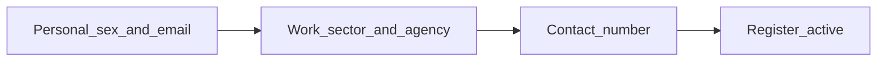

**What happens today**

- [`views/register.php`](views/register.php): `first_name`, `last_name`, `email`, `sector`, and `agency_select` have `required` and a `*`. `sex` is a select that includes a blank “Select”. `contact_no` has no `required`. The scripted submit buttons (`#btnRegister`, `#btnRegisterSticky`) say “Complete Registration” and start hidden. A separate `#btnRegisterFallback` says “Register”.
- [`assets/guest-registration.js`](assets/guest-registration.js): Continue enables when the current step’s required fields are valid. Register is shown only on step 3, and only when `isFormComplete()` and the email check is `free`. A blank sex or contact number does not block that, because those inputs are not required.
- [`ParticipantValidator`](src/Services/ParticipantValidator.php): first name, last name, sector, agency, and email are required. Sex and contact number are optional. A contact number, when present, must be 7–20 digits. An empty sex or contact number still saves.

**Locked choices**

- Required set: first name, last name, **sex**, **email**, sector, agency, **contact number**. Sex must be one of Female, Male, or Other (the existing “Prefer not to say” value). Email stays one address per event. Contact number uses the current 7–20 digit rule, and empty is no longer allowed.
- Register stays on the form. It is visible but inactive (muted, not clickable) until every required field is filled and the email check is free. Then it is the active submit. Personal and Work never show an active Register.
- One Register control while JavaScript is on. The fallback Register is only for no-JS. It must not sit under the steps as a second active button.
- Continue still moves one step at a time, and only when that step’s required fields are filled. Step 1 now includes sex and email. Step 3 includes contact number.
- Server rejects a submit that omits sex, email, or contact number, even if the button was bypassed. Flash the same field errors the form already uses. Do not drop the answers already typed.
- Bump the `?v=` on `guest-registration.js` when this ships.

**1. Mark the three fields required**

In [`views/register.php`](views/register.php):

- [x] Sex label gets `*`, the select is `required`, and the blank “Select” option stays so an untouched sex is invalid.
- [x] Email keeps `required` and its hint.
- [x] Contact No label gets `*`, and the input is `required`. (Also `pattern="[0-9+\-\s]{7,20}"` so a short number fails `checkValidity()` and keeps Continue/Register inactive, plus a one-line hint.)
- [x] Extra fix found while verifying: the **sector** select never re-selected the posted value on a retry (sex/agency did). It now marks the posted option (and “Other”) `selected`, so no typed answer is lost.

**2. Register is active only when the form is complete**

In [`assets/guest-registration.js`](assets/guest-registration.js):

- [x] `isStepComplete` / `isFormComplete` treat sex, email, and contact number as required (they follow the `required` attribute; the new markup attributes carry the gating).
- [x] `#btnRegister` and `#btnRegisterSticky` stay disabled and muted until all required fields are valid and `emailStatus === 'free'`. They are not an active submit on Personal or Work. (Register is shown on the Contact step — visible but disabled at opacity ~0.45 with `pointer-events: none` — instead of hidden until complete.)
- [x] `#btnRegisterFallback` does not show as an active Register beside those buttons. (Already hidden at init by the script; re-verified in the browser.)

**3. Server agrees**

In [`ParticipantValidator`](src/Services/ParticipantValidator.php):

- [x] Empty sex is an error. Value must be Female, Male, or Other. (`ParticipantValidator::SEXES` allow-list; empty → “Sex is required”.)
- [x] Empty email stays an error.
- [x] Empty contact number is an error. A present number still has to match 7–20 digits.
- [x] Cover the three cases in [`scripts/test_participant_validator.php`](scripts/test_participant_validator.php). (Blank sex, invalid sex, “Other” valid, blank contact, short contact; suite is 17 green.)

**Checks**

- [x] Personal: sex left on “Select” or email blank → Continue stays inactive, Register stays inactive. (Register is not even visible on Personal.)
- [x] Work: sector or agency blank → Continue stays inactive, Register stays inactive.
- [x] Contact: number blank, or shorter than 7 digits → Register stays inactive. (Register visible but muted/disabled on the Contact step.)
- [x] All required fields filled and the email is free → Register is the active button and submits. (Browser run: clicking Register lands on the success page with the QR.)
- [x] A POST missing sex, email, or contact number is rejected and the typed answers remain. (Missing contact → “Contact number is required”; missing sex → “Sex is required”; retry rehydrates names, sex, email, sector, agency, contact.)
- [x] Middle name, nickname, designation, and office email can still be left blank. (Validator suite passes with them absent; the successful browser registration had them blank.)
- [x] Local signed off before any prod overlay. (Deploy for the operator: `views/register.php`, `assets/guest-registration.js` + `views/partials/guest_footer.php` with `?v=20260923reg`, `src/Services/ParticipantValidator.php`, `src/Controllers/RegisterController.php`, `scripts/test_participant_validator.php`. The RegisterController change is the pending live email-check backend (`register_email_check`, office-email duplicate handling) this plan’s `emailStatus === 'free'` gating builds on. No migration, no `.env` change.)

Leave alone: the door and circuit field, CoA outbox, field names already posted, EventContext. Do not commit `.env`.

### Plan#14 — Registration page open performance

Opening a gate-layout registration page (Hack for Gov 5, `/?r=register&e=...`) lags and uses a lot of CPU/GPU. Confirmed by a 2026-09-23 open test. The form steps are not the cost. Two full-viewport canvas loops start before the guest can type, and one of them never stops.

Keep the door, the flag mark, and a moving circuit field (Plan#6 through Plan#8). This pass only cuts the work those effects do on open and while the form is on screen. Public Sans and the federal navy stay. Non-gate events already skip [`assets/hack4gov-gate.js`](assets/hack4gov-gate.js); leave that guard in place.

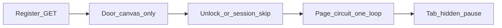

**What runs today**

[`views/partials/guest_head.php`](views/partials/guest_head.php) loads the gate CSS and JS when `theme_layout` is `gate`. [`views/partials/guest_gate.php`](views/partials/guest_gate.php) paints two canvases before the form:

1. `#eventGatePageCircuits` — `initPageCircuits()` in [`assets/hack4gov-gate.js`](assets/hack4gov-gate.js). Desktop builds 84 seeds × 2 segments (168). Every animation frame clears the whole canvas and, per segment, measures pointer distance, strokes twice, fills an arc, and sets `shadowBlur` between 8 and 22. `requestAnimationFrame` never stops. A return visit removes `#eventGate` via session storage and still leaves this loop running. The buffer uses `devicePixelRatio` capped at 2, so a 1920×1080 screen is about an 8 megapixel canvas.
2. `#eventGateWindow` — the same painter, 64 seeds × 2 segments (128), started immediately by `startParticles()`. It does stop about 900ms after unlock. While the door is up, both loops run together (about 296 glowing segments a frame).

`prefers-reduced-motion` already draws once and skips the loop. Keep that.

On the server, [`RegisterController::show`](src/Controllers/RegisterController.php) runs two `SELECT DISTINCT ... LIMIT 500` scans (`agency`, `designation`) before any HTML. That can slow first byte as the event grows. Measure it; do not rewrite it unless it shows up in the timing.

**Locked choices**

- One animated canvas at a time. While the door window runs, the page circuit stays paused. After unlock, and on a session-skip return, only the page circuit runs.
- Pause the page circuit when the tab is hidden (`document.visibilitychange`). Resume with a single frame when it is visible again.
- No `shadowBlur` on the per-frame path. The traveling dash is a plain stroke. A second thinner stroke can stand in for the glow.
- Page canvas DPR cap is 1. Door canvas DPR cap is 1.5, and only while that canvas is visible.
- About half of today’s seed counts (desktop page ~40, door ~28). Phone keeps the smaller branch it already has.
- Pointer lighting updates on a timer (about 50ms), not as a distance test of every segment inside the frame.
- Resize is debounced (~150ms). A drag-resize must not rebuild the buffer on every event.
- No new libraries. Same `?r=register` route. Same door sequence and focus move to `first_name`. Bump the `?v=` on `hack4gov-gate.js` and `hack4gov-gate.css` when this ships so browsers drop the old loop.

**1. One light circuit loop**

In [`assets/hack4gov-gate.js`](assets/hack4gov-gate.js):

- [x] Do not start `initPageCircuits` while `#eventGate` is on screen. Start it from `release()`, and immediately when the session skip already removed the gate.
- [x] Cancel the page `requestAnimationFrame` on `visibilitychange` hidden; restart when visible.
- [x] Remove per-frame `shadowBlur` from both `drawTrace` copies (page and door).
- [x] Cap page DPR at 1 and door DPR at 1.5.
- [x] Cut seed counts to about half.
- [x] Move pointer hit-testing out of the frame loop onto a ~50ms timer.
- [x] Debounce `resize` on both canvases.

**2. Do not add paint on the door**

- [x] [`views/partials/guest_gate.php`](views/partials/guest_gate.php) keeps one logo URL for both halves (`assets/hack4gov-door-logo.png`). Do not add another image.
- [x] Do not add `filter`, `backdrop-filter`, or new infinite animations in [`assets/hack4gov-gate.css`](assets/hack4gov-gate.css). (File untouched this pass.)

**3. Server open path, only if it is slow**

- [x] Time the two `DISTINCT` queries in `RegisterController::show` against the local Hack for Gov 5 event. Change them only if they dominate time to first byte (over ~30ms locally). Otherwise leave the SQL. Measured 2026-09-23: ~0.3ms total with 0 rows; ~6-7ms total after seeding 3,000 participants — far under 30ms, so the SQL is unchanged.

**Checks**

- [x] Local open of the Hack for Gov 5 register link: the form is usable without a multi-second stall. (responseEnd ~190ms, DCL ~340-685ms; form fields live behind and right after the door.)
- [x] While the door is up, only the door canvas is animating. After unlock, and on a return visit, only the page circuit is animating. (Verified in a full-motion harness with a rAF counter: page canvas untouched while the door runs, door cleared at release+900ms, one loop after.)
- [x] Backgrounding the tab stops the loop. Coming back starts it again. (Browser-verified that rAF freezes when the view is backgrounded and resumes on return; the explicit cancel/resume branch is the same cancel pattern as the verified `stopParticles` — this IAB never reports `document.hidden`, so the synthetic event could not be fired locally.)
- [x] `prefers-reduced-motion` still paints a static field and does not loop. (OS reduce is on here: static paint confirmed on both the door window and the page field; no rAF loop.)
- [x] A phone-width viewport still shows a circuit field, and resizing does not hitch. (390x844: canvas rebuilt to 354x767 and painted; an 8-event resize burst caused 0 immediate buffer rebuilds and exactly 1 after the 150ms debounce.)
- [x] A non-gate event still does not load `hack4gov-gate.js`. (`test-event`: 0 gate script/CSS tags, 0 resource entries.)
- [x] Door, mark, and circuit colors (gold `#FCD116`, blue `#0038A8`, red `#CE1126`) still read as Hack for Gov 5. Form steps and field names are unchanged. (Screenshots reviewed; canvas pixel sampling found all four trace tones; door and seal untouched.)
- [x] Local signed off before any prod overlay. Overlaid 2026-09-23: `assets/hack4gov-gate.js` + `views/partials/guest_head.php` with `?v=20260923`. No migration, no `.env` change. Live register page includes that script.

Leave alone: Plan#13 outbox, registration field names, QR email, Report builder, EventContext. Do not commit `.env`.

### Plan#13 — Per-event CoA outbox (queued / sent / failed)

All Father can already **compose + schedule** a CoA send from a template, and cron does fire. What is missing is a clear **per-event list of every email**: who is still queued, who was sent, who failed. Today you only see that after opening a batch, and several scheduled times get folded into one reused batch.

**Order:** implement and browser-check on the **local copy**. When local is good, overlay the same files on production (keep server `.env` and `storage/`). Do not start on prod.

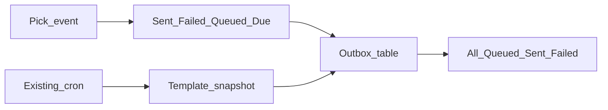

**How it works today (do not rebuild this)**

- Compose on [`views/admin_coa_monitor.php`](views/admin_coa_monitor.php): event + attendance date + optional template + checkboxes + `send_at`.
- [`AdminCoaMonitorController::sendSelected`](src/Controllers/AdminCoaMonitorController.php) snapshots the template onto overrides and calls [`CoaService::sendBatch`](src/Services/CoaService.php).
- Future `send_at` inserts `coa_sends` as `queued`. Cron [`scripts/coa_process_scheduled.php`](scripts/coa_process_scheduled.php) calls `processDue` → `resendRow`.
- Monitor KPIs and Recent batches can scope by `event_id`, but the recipient table only appears after **Open** on a batch. There is no “all queued for this event” list.

**Gaps to close**

1. **No event outbox.** Queued rows live across batches. Opening batch #1 is not “every queued email for Hack for Gov 5.”
2. **One reused scheduled batch per event + date.** [`ensureBatch`](src/Services/CoaService.php) returns the last `scheduled` batch for that date, so 08:00 and 10:55 land in the same batch. Hard to tell what is waiting vs already failed.
3. **Cron drops the template.** `resendRow` calls `generate()` from the **event** CoA columns, not the compose template / batch snapshot. Scheduled PDFs can ignore the chosen template.
4. **Queued mixes two meanings.** Future `send_at` (waiting) and “Queue failed” retries (`send_at` null, due immediately) share `status=queued`.
5. **Mail errors are opaque.** [`Mailer`](src/Services/Mailer.php) swallows the SMTP exception; the row only says `Mail send failed`.
6. **Pagination** is on batches and batch recipients only. The new event list must paginate the same way (20 per page).

**Locked choices**

- All Father only. Same `?r=admin_coa_monitor`, Asia/Manila, 50-per-tick cron. No new frontend stack. No second schedule table.
- Event is the primary scope. Default the dropdown to the current event (or the last scoped `event_id`). “All events” stays as a roll-up of KPIs + batches, but the outbox table requires an event (prompt to pick one).
- One **Outbox** table for that event: name, agency, email, status, scheduled time, template/batch, error, preview. Filter chips: All / Waiting / Due / Sent / Failed / Skipped.
  - **Waiting** = `queued` AND `send_at` > now
  - **Due** = `queued` AND (`send_at` IS NULL OR `send_at` <= now)
  - **Queued** KPI = Waiting + Due, with the two counts shown in the hint line
- Keep Recent batches. Do not hide them. Outbox is the default view when an event is selected.
- Cancel still removes only still-queued rows. Add **Cancel selected** on the outbox (queued rows only).
- Queue failed / Resend queued stay, scoped to the selected event.

**1. Event outbox UI**

On [`views/admin_coa_monitor.php`](views/admin_coa_monitor.php) + [`AdminCoaMonitorController::monitor`](src/Controllers/AdminCoaMonitorController.php):

- [x] When `event_id` is set: load `coa_sends` for that event (join participant name/agency), paginate 20, honor `status` / waiting / due filter.
- [x] KPI strip stays honest and event-scoped: Sent, Failed, Queued (waiting + due in the hint), Skipped, Batches.
- [x] Show `send_at` and the template name (from `coa_batches.template_id` → `coa_templates.name`, else “Event settings”).
- [x] Empty state: “No sends for this event yet. Compose a send below.”
- [x] Status chips and page links keep `event_id`.

**2. Schedule must keep the template**

- [x] Stop reusing one scheduled batch per date. `ensureBatch` for `source=scheduled` creates a **new** batch each compose (so each `send_at` is its own run). Auto/manual may still reuse per date.
- [x] `resendRow` / cron rebuilds the PDF from the **batch** (`template_id` + venue / signatory snapshots), then falls back to event CoA settings. Same path as compose send-now.
- [x] Persist a short SMTP/mail error on `coa_sends.error` (trim to 255). Keep the user-facing label, but stop throwing the real reason away.

**3. Local first, then prod**

- [x] Local: `php scripts/test_coa.php` (compose, schedule, processDue, cancel). Add cases: two schedules same day = two batches; cron PDF uses the template venue; event outbox lists waiting rows.
- [ ] Local browser: pick Hack for Gov 5 → see outbox filters → schedule two people → they appear under Waiting → after due, Sent or Failed with a real error if mail breaks.
- [x] Prod only after local sign-off: upload the touched PHP/views (not `.env`, not `storage/`). Cron is already installed; do not add a second crontab. Overlaid 2026-09-23. Signed-out `/?r=admin_coa_monitor` returns to admin login (not 404). Register page loads `hack4gov-gate.js?v=20260923`.

**Checks**

- [ ] Certificates → event selected → outbox lists every send for that event without opening a batch
- [ ] Waiting / Due / Sent / Failed filters match the KPI numbers
- [x] Schedule with a template → after cron, PDF venue/topic/signatory match the template
- [x] Two schedules the same day show as two batches and two `send_at` groups
- [x] Failed row shows more than the words “Mail send failed” when SMTP returns a reason
- [x] `php scripts/test_coa.php` ALL OK
- [ ] Local signed off before any prod overlay

Leave alone: guest gate, registration fields, QR email, Report builder, EventContext, signatory upload UI. Do not commit `.env`.

### Plan#12 — CoA control center (templates, signatories, compose, schedule)

All Father needs **one Certificates facility** to:

- save reusable CoA templates
- edit **venue/location** and **topic**
- pick a **signatory with an uploaded e-signature**
- send **one person or many**, as chosen
- **schedule** a send so it runs later (plus keep scan auto-send)

Plan#11 is **live on prod** (`/?r=admin_coa_monitor` is a real route; signed-out requests go to admin login, not 404). Plan#12 is also live: signatory uploads, compose/schedule, and the Hostinger cron worker.

Also include a live Attendance bug: the **In Vicinity Rate** card does not show the KPI its label describes (see below).

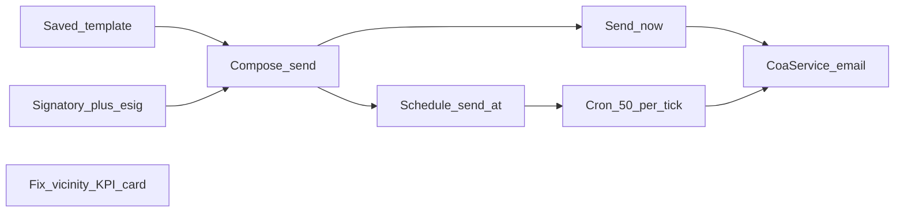

**Locked choices**

- All Father only. Same `?r=` stack, [`CoaService`](src/Services/CoaService.php), Asia/Manila.
- **Topic** = existing `purpose` / `coa_purpose` (relabel in UI). No extra title column. PDF event name stays `events.name`.
- **Venue** = existing `venue` / `coa_venue`.
- Send uses a **chosen template snapshot** for that batch (venue, topic, particulars, signatory). Applying a template to the event is still available, but not required to send.
- Signatories live in **`coa_signatories`**. Templates/events pick by id; name/title/path are copied onto the template/event row so Plan#10 generate still works.
- Schedule = **`coa_sends.send_at`** (no second schedule table). `queued` + future `send_at` waits; `send_at` null or past is due.
- Scan auto-send (`coa_enabled`) stays. That is immediate automation after attendance. Scheduled compose is “send this list at 5pm.”
- Cap **50** PDFs per HTTP action and per cron tick (same as Plan#11 resend).
- One nav item **Certificates**. Page header links: Monitor | Templates | Signatories.

**0. Deploy Plan#11 first**

Deployed 2026-09-22 with the full sync. Prod `/?r=admin_coa_monitor` is routed (login-gated). `014`/`015` applied; `storage/coa` and `storage/coa/signatures` exist. Server `.env` was not overwritten.

**1. Signatory library + e-signature upload**

Migration `015_coa_facility.sql` (MyISAM, no FKs; wire in [`Database::runMigrations`](src/Services/Database.php)):

- [x] **`coa_signatories`**: `id`, `name`, `title`, `signature_path`, `created_at`, `updated_at`
- [x] **`coa_templates.signatory_id`** INT NULL
- [x] **`events.coa_signatory_id`** INT NULL
- [x] **`coa_sends.send_at`** DATETIME NULL
- [x] **`coa_batches.template_id`** INT NULL; `source` also allows `scheduled`

UI `?r=admin_coa_signatories` (All Father, CSRF):

- [x] Name, title, file upload PNG/JPG/WebP, max 1 MB
- [x] Store under `storage/coa/signatures/{id}/` using the same checks as [`AdminEventsController::storeBrandingImage`](src/Controllers/AdminEventsController.php)
- [x] Preview thumbnail via a small admin stream route (file is not web-public)
- [x] Templates form and Events CoA block: **Signatory** dropdown instead of typing a path. Saving copies name/title/path onto the template/event columns.
- [x] [`CoaService`](src/Services/CoaService.php) resolves relative `storage/...` paths against the project root so the e-sig actually prints on the PDF.

**2. Templates (venue + topic)**

Keep [`views/admin_coa_templates.php`](views/admin_coa_templates.php); relabel fields:

- [x] Template name
- [x] **Venue / location**
- [x] **Topic** (stored as `purpose`)
- [x] Particulars
- [x] Signatory dropdown
- [x] Save / Update / Apply to event / Preview

**3. Compose: individual or bulk**

On [`views/admin_coa_monitor.php`](views/admin_coa_monitor.php), a **Compose send** card:

- [x] Event, attendance date, **template** (optional; event CoA settings as fallback)
- [x] Table of attendees for that date: checkbox, name, agency, email, last CoA status
- [x] No email → checkbox disabled
- [x] **Send selected** (1 or many), **Send all missing** (existing Send new), **Schedule selected**
- [x] POST `admin_coa_send_selected`: participant ids + template_id + event + date + optional `send_at`
- [x] Create a batch, snapshot template/signatory/venue/topic, then `CoaService` send (or queue if scheduled)
- [x] `CoaService::sendNow` optional overrides (venue, purpose, particulars, signatory) so compose does not have to mutate the event row
- [x] Registrants **Resend COA** stays for a one-off from that list

**4. Schedule + cron**

- [x] Compose datetime-local (`send_at`, Asia/Manila). Future time → insert `coa_sends` as `queued` with that `send_at`. Send now → process immediately.
- [x] [`scripts/coa_process_scheduled.php`](scripts/coa_process_scheduled.php): due rows (`status=queued` AND (`send_at` IS NULL OR `send_at` <= now`)), cap 50, reuse `CoaService::resendRow`.
- [x] Hostinger cron: `* * * * * cd /home/digitalhero/htdocs/digitalhero.dictr2.cloud && php scripts/coa_process_scheduled.php` (digitalhero crontab, 2026-09-22; one-shot run `processed=0 sent=0`)
- [x] Monitor shows scheduled batches (source `scheduled`) and a **Cancel** for still-queued future rows.
- [x] Scan auto-send remains the other automation switch on Events.

**5. KPI card that does not match its label (Attendance)**

On [`views/admin_attendance.php`](views/admin_attendance.php) the second gradient card is labeled **In Vicinity Rate** but the number is `attendanceRate` — accounted / not-absent percentage (`X of Y (excl. absent)`). That is not vicinity.

The SEO dashboard already splits these correctly in [`views/admin_seo_dashboard.php`](views/admin_seo_dashboard.php): **In vicinity** = `vicinityCount` (“On site, not signed”); **Accounted rate** = `attendanceRate`.

- [x] Make the Attendance card show the KPI its label describes: the number must be **in-vicinity** (`vicinityCount`, people on site who have not signed in).
- [x] If accounted rate is still needed on Attendance, add a **separate** card labeled **Accounted rate** (same meaning as SEO). Do not keep one card whose title says vicinity and whose figure is attendance rate.
- [x] Keep the other Attendance cards honest: **Signed In** = present for the selected date; **Last Hour** = sign-ins in the past 60 minutes (or N/A on a past date); **Busiest hour** = peak window.
- [x] Certificates monitor KPI strip must stay equally honest: Sent / Failed / Queued / Skipped / Batches each count only that status (scoped to the selected event). Add a one-line hint under each so a number is not mistaken for another (especially Queued vs Scheduled).

**Checks**

- [x] Plan#11 URL on prod loads Certificates (`/?r=admin_coa_monitor` is not 404; signed-out → `/?r=admin_login`)
- [x] Upload e-sig → pick on template → Preview shows the signature
- [x] Check 3 attendees, pick template, Send selected → 3 mails / 3 `coa_sends` using that venue/topic
- [x] Schedule +2 minutes → cron marks sent without a second click
- [x] Cancel a future batch before `send_at` → no mail
- [x] Attendance **In Vicinity** card number matches vicinity people, not accounted rate
- [x] `php scripts/test_coa.php` still ALL OK, plus compose/schedule cases
- [x] After local smoke, deploy `015` + views/controllers/script (full sync 2026-09-22)

Leave alone: guest gate, registration fields, QR email, Report builder, EventContext. Do not add a frontend stack. Do not commit `.env`.

### Plan#11 — Certificate send monitor, nav, and templates

Plan#10 already auto-generates and emails CoA PDFs via [`CoaService`](src/Services/CoaService.php), but outcomes only land in `action_logs` and files under `storage/coa/`. There is no list UI, no dedicated nav item, and no All Father preview. Target is the previous **Certificate send monitor**: KPIs, batches, venue + event title on the batch, recipient statuses, resend queue, and preview.

Also required in this plan:

1. Put **Certificates** on the main admin nav as its **own** item (not nested under Events or Report).
2. Fix the arrangement of menus in the main navigation into a clear left-to-right workflow.
3. Let All Father **edit the content / parts of the certificate** and **save them as named templates**, then apply a template to the current event and preview before send.

Keep Plan#10 auto-send after scan. Event title = `events.name`. Venue = `events.coa_venue` (snapshotted onto each send so history stays stable if settings change).

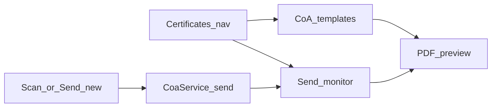

**Navigation** ([`views/partials/admin_nav.php`](views/partials/admin_nav.php)):

- [x] Add a separate link **Certificates** → `?r=admin_coa_monitor` (role `admin` / All Father only). Not nested under Events or Report.
- [x] Reorder `$adminNavLinks` (role filters unchanged):
  - Day-of ops: Registrants, Attendance, Scan, Gallery, Register
  - Certificates: **Certificates** (All Father)
  - Data: Import, Export, Report
  - Insights: SEO Dashboard
  - Platform: Events (All Father), Event Links (event_admin), Users, Logs, Settings

**Data** — migration `014_coa_monitor.sql` (MyISAM-safe, no FKs; wire in [`Database::runMigrations`](src/Services/Database.php) like `013`):

- [x] **`coa_batches`**: `id`, `event_id`, `created_at`, `inclusive_date`, `signatory_name`, `venue_snapshot`, `event_name_snapshot`, `source` (`auto` | `manual`)
- [x] **`coa_sends`**: `id`, `batch_id`, `event_id`, `participant_id`, `attendance_date`, `email`, `status` (`sent` | `failed` | `queued` | `skipped`), `error`, `pdf_path`, `event_name_snapshot`, `venue_snapshot`, `signatory_snapshot`, `created_at`, `updated_at`
- [x] **`coa_templates`**: `id`, `name`, `venue`, `purpose`, `particulars`, `signatory_name`, `signatory_title`, `signatory_path`, `logo_path`, `created_at`, `updated_at`
- [x] [`CoaService`](src/Services/CoaService.php) writes `coa_sends` on every auto-send and resend; attaches to today’s auto-batch for that event + attendance date (create batch if missing). Snapshot event title and venue on each row.

**Monitor** (All Father) — [`views/admin_coa_monitor.php`](views/admin_coa_monitor.php) + [`AdminCoaMonitorController`](src/Controllers/AdminCoaMonitorController.php):

- [x] KPI strip: Sent / Failed / Queued / Batches (scoped to current event when one is selected, else all events)
- [x] Actions: Send new (manual batch from attendees missing a successful CoA for a chosen attendance date), Queue failed for resend, Resend queued (cap 50), Refresh, link to **Templates**, **Preview template**
- [x] Recent batches table: #, When, Inclusive dates, Signatory, Sent/Failed/Queued/Skipped, Open
- [x] Batch detail header shows **event title** + **venue** + inclusive date + issued date; filters All/Sent/Failed/Queued/Skipped; recipient rows Name, Agency, Email, Status, Error, **Preview**

**Templates** (All Father edits certificate parts) — `?r=admin_coa_templates`:

- [x] Form fields: template name, venue, purpose line, particulars (one line per row), signatory name/title, optional logo/signature paths
- [x] **Save as template** / **Update template**
- [x] **Apply to current event** copies template fields onto that event’s Plan#10 CoA columns (`coa_venue`, purpose, particulars, signatory, logos)
- [x] **Preview** renders a sample PDF from the template (placeholder participant name)
- [x] Event-level CoA block on Events stays for per-event overrides; templates are the reusable library

**Preview** (All Father only, never emails):

- [x] Route `admin_coa_preview` — for a `send_id` or `participant_id`+`date`: generate (or reuse file) and stream PDF inline (`Content-Disposition: inline`)
- [x] Route `admin_coa_preview_template` — sample PDF from current event CoA settings or a saved `template_id`

**Routes** (add to [`config/routes.php`](config/routes.php); all `_guards` All Father / `admin`):

- [x] `admin_coa_monitor`, `admin_coa_send_new`, `admin_coa_queue_failed`, `admin_coa_resend_queued`, `admin_coa_preview`, `admin_coa_preview_template`, `admin_coa_templates` (+ save / apply actions)

**Checks**

- [x] Certificates appears as its own nav item in the new menu order
- [x] Template save → apply to event → preview shows venue and event title
- [x] Scan creates send rows; batch detail shows title + venue; Preview opens PDF
- [x] Send new batches missing attendees; failed rows can queue and resend
- [x] After it works locally, deploy migration `014` + controllers/views to `/home/digitalhero/htdocs/digitalhero.dictr2.cloud` (full sync 2026-09-22; `coa_batches` / `coa_sends` / `coa_templates` present)

Leave alone: scan CSRF, registration fields, QR email, guest gate, Report builder. Event admins keep Registrants **Resend COA**; the monitor, templates, and preview are All Father only.

### Plan#10 — restore Certificate of Appearance (auto-create + auto-send)

The previous app version generated a dual-copy DICT Certificate of Appearance PDF and emailed it after attendance. Restored in this tree and deployed 2026-09-22.

Reuse what already works: TCPDF (see [ReportController](src/Controllers/ReportController.php)), [`Mailer::send`](src/Services/Mailer.php) with attachment path, and the signed attendance hook in [AttendanceController::submit](src/Controllers/AttendanceController.php) (today it saves the row and returns JSON only). A static `ca/CERT OF APPEARANCE.pdf` once sat on production docroot; that was not the generator and was removed.

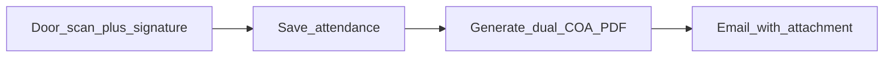

**PDF** (two identical certificates side by side, cut line): DICT logo left, Bagong Pilipinas right; title CERTIFICATE OF APPEARANCE; name + agency, venue, date, event purpose; particulars table (lodging / meals / vehicle); issue date; signatory name/title + signature image; Region II footer.

**Email:** From display = event name; subject `Certificate of Appearance — {Month D, YYYY}`; body Dear {Name}, attached CoA for **{date}**; attachment `coa_{participantId}_{YYYYMMDD}.pdf`.

Defaults for this restore:

1. **Trigger:** After a successful door scan + signature. Also an admin **Resend COA** on registrants/attendance. Skip if the participant has no email. Do not block the scan JSON if mail fails (log and continue).
2. **Particulars / venue / signatory:** Per-event CoA settings (All Father), with defaults so an event works before settings are filled: DID NOT PROVIDE hotel/lodging, PROVIDED food and meals - Lunch, DID NOT PROVIDE VEHICLE; inclusive date = attendance date.

- [x] Add [`src/Services/CoaService.php`](src/Services/CoaService.php): TCPDF dual-copy layout matching the DICT sample. Store under `storage/coa/{eventId}/` (not web-public).
- [x] Per-event CoA settings (migration on `events`): enable flag, venue, purpose line, particulars text, signatory name/title, logo/signature paths. All Father UI to edit them.
- [x] After attendance insert succeeds, if CoA is enabled and the participant has an email: generate PDF → `Mailer::send`. Wire the same path from `submitJsonForTest` for tests.
- [x] Admin resend route (e.g. `admin_coa_send`) on the registrants or attendance list.
- [x] Ship DICT / Bagong Pilipinas logos under `assets/` (or reuse uploaded branding). Do not commit the old Reference HTML.
- [x] After it works locally, deploy to `/home/digitalhero/htdocs/digitalhero.dictr2.cloud`, run the migration, smoke one scan → inbox PDF. Deployed 2026-09-22: migration `013` applied (`coa_enabled` present), `CoaService` and routes live, `storage/coa` created. Events still have `coa_enabled=0` until All Father turns CoA on per event.

Leave alone: registration field names, CSRF, QR email on register, and the bulk attendance report builder.

### Plan#9 — richer door unlock animation

Reading this as: the Hack for Gov 5 entrance for event guests, with the sharp flag-block mark already on the doors, leaning toward navy `#0B1B45`, gold `#FCD116`, blue `#0038A8`, and red `#CE1126` — a staged unlock that opens onto the circuit background and the form, not a faster fade.

Access System still runs the short sequence in [assets/hack4gov-gate.js](assets/hack4gov-gate.js): bolts, then the doors swing, then `.event-gate.done` fades the overlay. The mark stays sharp (it is no longer stretched). The opening still feels thin: the HUD disappears early, the particle window is only a brief gap, and the registration page arrives as a fade instead of a reveal of the Plan#8 circuit field.

Stay in the gate files. No new library, no migration, no change to field names, CSRF, or `?r=register&e=`. Other events have no door. `prefers-reduced-motion` keeps the short slide and a still background. Session skip, validation error, and Try again still skip the door. Cache-bust the stylesheet with a new `?v=`.

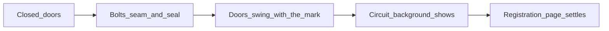

- [x] Stage the unlock in [assets/hack4gov-gate.css](assets/hack4gov-gate.css) and [assets/hack4gov-gate.js](assets/hack4gov-gate.js): bolts draw back, the gold seam brightens, the seal clears, then the doors swing with the sharp mark. Hold the open doors long enough to see the circuit background in the gap before the overlay leaves.
- [x] Hand the page over: the Plan#8 circuit field is what shows through the opening, then the side panel and the form settle into place. Remove the feeling of a hard cut. Focus still moves to `first_name` after the reveal.
- [x] Keep Access System and Enter as the only unlock controls. The button stays clickable until the sequence starts.
- [x] Reduced motion: doors slide and fade, the circuit background is already still, and the form fades in. No 3D swing.
- [x] A reload after unlock does not show the door again. Another event’s register link still has no door and no unlock sequence.
- [x] Phone width: the doors still cover the screen, and the form is usable after the reveal.
- [x] After it works locally, deploy the gate CSS and JS to `/home/digitalhero/htdocs/digitalhero.dictr2.cloud` with a new `?v=`. No migration and no `.env` change. Deployed 2026-09-22; Access System unlocks onto the register form.

Leave alone: the logo file, `theme_layout`, slug `hack4gov-5-8`, and the 3-step fields.

### Plan#8 — moving circuit background on the registration page

Reading this as: the Hack for Gov 5 register page for event guests, with the flag-block mark already in the side panel, leaning toward navy `#0B1B45`, gold `#FCD116`, blue `#0038A8`, and red `#CE1126` — a quiet circuit field in the page background, not a second logo and not a new visual system.

The live page at `/?r=register&e=hack4gov-5-8` shows the mark, the steps, and the form. The area around them is the static grid from [`.guest-page::before`](assets/guest-registration.css). The circuit SVG only frames the logo inside `.event-gate-hero-art`. The background itself does not move, and it does not answer the pointer.

Only when `theme_layout` is `gate`. Other events keep the current grid. No new library, no migration, no change to field names, CSRF, or `?r=register&e=`. The form card, the side panel, and the inputs stay opaque and clickable. `prefers-reduced-motion` paints the traces and leaves them still. Cache-bust [assets/hack4gov-gate.css](assets/hack4gov-gate.css) the way `?v=` already does, because production caches stylesheets for a long time.

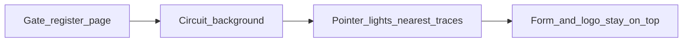

- [x] Add one full-page circuit layer on the gate register page, behind the navbar, the side panel, and the form. Traces and nodes use the logo palette: gold `#FCD116`, blue `#0038A8`, red `#CE1126`. A dash travels along the traces. Scope it under a gate-only class in [assets/hack4gov-gate.css](assets/hack4gov-gate.css), which loads only for this layout.
- [x] In [assets/hack4gov-gate.js](assets/hack4gov-gate.js), the pointer and touch brighten the nearest background traces. The layer is `pointer-events: none`, with the listener on the page, so typing, the stepper, Continue, and Register stay usable. Cap the trace count on narrow screens.
- [x] Keep the existing logo frame. The new field is the page background, so it shows in the open space around the panel and the form. It does not paint over the mark, the steps, or the white form card.
- [x] Reduced motion: the background traces stay painted, with no traveling dash and no pointer chase. The static grid on other events stays as it is.
- [x] Session skip, validation error, and Try again still reach this form, so the background is there too. A second event’s register link has no circuit background.
- [x] Phone width: fewer traces, still behind the card, and the form remains the page.
- [x] After it works locally, deploy the gate CSS, JS, and the small markup change to `/home/digitalhero/htdocs/digitalhero.dictr2.cloud` with a new `?v=` on the stylesheet. No migration and no `.env` change. Deployed 2026-09-22; `event-gate-page-circuits` is on `/?r=register&e=hack4gov-5-8`.

Leave alone: the door, the logo file, `theme_layout`, slug `hack4gov-5-8`, and the 3-step fields.

### Plan#7 — Hack for Gov mark and moving circuits on the registration page

Reading this as: the Hack for Gov 5 registration form for event guests, with the existing flag-block mark, leaning toward navy `#0B1B45`, gold `#FCD116`, blue `#0038A8`, and red `#CE1126` — the full logo on the form, with circuit traces that travel and answer the pointer.

The door already splits [assets/hack4gov-door-logo.png](assets/hack4gov-door-logo.png). The form behind it does not. [views/partials/guest_hero.php](views/partials/guest_hero.php) still shows the generic “G” icon on phones and a text panel on desktop. The logo file is a raster, so the circuit lines inside the letters cannot be animated from the PNG. Draw a separate circuit layer over and around the mark.

Only when `theme_layout` is `gate`. Other events keep the current hero. No new library, no migration, no change to field names, CSRF, or `?r=register&e=`. Reuse the same PNG the door uses. `prefers-reduced-motion` shows the logo and still traces. The circuit layer does not sit on top of inputs.

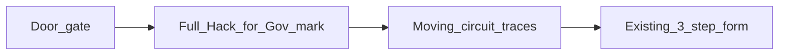

- [x] On the gate register page, show the full `hack4gov-door-logo.png` in the hero in [views/partials/guest_hero.php](views/partials/guest_hero.php): above the title on desktop, and in place of the generic mobile icon. Alt text is the event name. The image scales inside the hero and does not cover the form.
- [x] Add an inline SVG circuit field in that hero: traces and nodes in gold, blue, and red, using the same palette as the logo. A dash animation runs along the traces so the graphic reads as live circuitry. Scope the CSS under a gate-only class in [assets/hack4gov-gate.css](assets/hack4gov-gate.css), which already loads only for this layout.
- [x] In [assets/hack4gov-gate.js](assets/hack4gov-gate.js), the pointer and touch brighten the nearest traces and nodes. The layer is `pointer-events: none` except for that listener on the hero, so typing and the stepper stay usable. Cap the trace count on narrow screens.
- [x] Reduced motion: the logo and traces stay painted, with no traveling dash and no pointer chase.
- [x] Session skip, validation error, and Try again still reach this same form, so the mark and circuits show there too. A second event’s register link has no Hack for Gov image and no circuit SVG.
- [x] Phone width: the mark sits in the hero, the form remains the page, and circuits stay behind the card.
- [x] After it works locally, deploy the hero partial plus the gate CSS and JS to `/home/digitalhero/htdocs/digitalhero.dictr2.cloud`. No migration and no `.env` change. Deployed 2026-09-22. Live register page includes the mark and circuit SVG.

Leave alone: the door’s split use of the same PNG, `theme_layout`, slug `hack4gov-5-8`, and the 3-step fields.

### Plan#6 — richer door, reveal into registration, window particles

Reading this as: a public-sector event entrance for Hack for Gov 5 guests, with the existing vault-door language, leaning toward flag navy `#0B1B45`, gold `#FCD116`, and red `#CE1126` — richer light and a pointer-reactive particle field in the opening, not a new visual system.

The live gate looks pale because [assets/hack4gov-gate.css](assets/hack4gov-gate.css) paints a 50% black vignette (`.event-gate-face::after`) over the full-color logo. After unlock, the doors swing and then `.event-gate.done` sets `visibility: hidden` at 2100ms, so the registration page pops in with no handoff. There is no window and no particle field.

Stay inside the gate files. No new library, no migration, no change to field names, CSRF, or `?r=register&e=`. Other events stay door-free. `prefers-reduced-motion` keeps the short slide and shows a still particle field (no drift, no pointer chase). Without JS the gate stays hidden, as it does now.

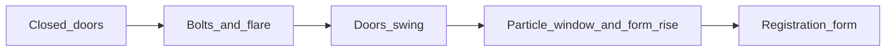

- [x] Lift the vignette off the logo so the flag blocks stay saturated. Keep a thin gold inner frame and a deeper navy face around the logo, not a gray wash across it.
- [x] Strengthen the seam, bolts, and seal so the unlock reads as metal and light: gold glow on the seam, bolts retract, flare, then the doors swing. Same timing family as today (bolts, then swing). Do not add a second animation library.
- [x] Add a window layer behind the doors in [views/partials/guest_gate.php](views/partials/guest_gate.php): a canvas (or one lightweight particle layer) scoped under `.event-gate`. Particles are small gold, white, and a few blue/red specks. They drift, and the pointer (and touch) nudges nearby particles. The Access System button and keyboard Enter stay on top and clickable. Cap the count on narrow screens.
- [x] Stage the handoff in [assets/hack4gov-gate.js](assets/hack4gov-gate.js) and the CSS: doors finish open, the particle window is visible in the gap, the registration page fades and rises into place, then the gate overlay fades out and scroll unlocks. Remove the hard `visibility` cut. Focus still moves to `first_name` after the reveal.
- [x] Reduced motion: doors slide and fade, particles stay still, the form fades in. No 3D swing and no pointer-driven motion.
- [x] Session skip, validation error, and Try again still skip the gate. A second event’s register link still has no door, no canvas, and no particle script.
- [x] Phone width: doors still cover the screen; particles stay behind the button; the form is usable after the reveal.
- [x] After it works locally, deploy the three gate files to `/home/digitalhero/htdocs/digitalhero.dictr2.cloud`. No migration and no `.env` change. Deployed 2026-09-22 with Plan#7.

Leave alone: the extracted logo file, `theme_layout`, slug `hack4gov-5-8`, and the 3-step form behind the door.

### Plan#5 — Hack for Gov 5 door gate

The sample in [Reference/hack4gov-login.html](Reference/hack4gov-login.html) is a **login mock** with a full-screen door. It is not a registration form. Use the door (split logo, gold seam, bolts, seal, “Access System”) as the entrance, then show the existing 3-step register form. Do not copy the 700KB HTML or its inline base64 into the app.

Existing event is **HACK4GOV 5**, slug `hack4gov-5-8`. Rename the display name to **Hack for Gov 5**. Keep the slug so current links still work.

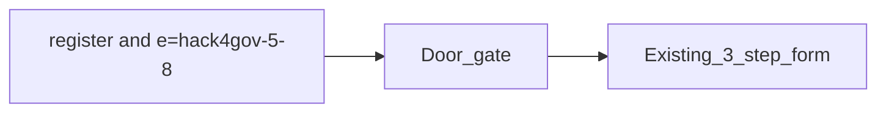

- [x] Extract door CSS (navy `#0B1B45`, gold `#FCD116`, red `#CE1126`, 3D open, reduced-motion slide) into [assets/hack4gov-gate.css](assets/hack4gov-gate.css). Scope it so admin pages and other events stay unchanged.
- [x] Extract the door logo **once** (both doors use the same image, split with `background-position`) into `assets/hack4gov-door-logo.png`.
- [x] Add [views/partials/guest_gate.php](views/partials/guest_gate.php) and [assets/hack4gov-gate.js](assets/hack4gov-gate.js). Unlock opens the doors, then reveals the form. `prefers-reduced-motion` uses the simpler slide. Skip the gate for the rest of the browser session, and on validation error / Try again.
- [x] Add `events.theme_layout` (`default` or `gate`) in `migrations/012_event_gate.sql`, wired like [011_event_theme.sql](migrations/011_event_theme.sql). Set `gate` on `hack4gov-5-8` only. [RegisterController](src/Controllers/RegisterController.php) passes that into [guest_head.php](views/partials/guest_head.php).
- [x] Optional Plan#4 colors (accent set to #8A6D00, a darkened gold, so small text on white keeps WCAG AA; the door itself uses the flag gold #FCD116) for this event: primary navy, accent gold, so the form behind the door matches. The door is the layout, not a banner image.
- [x] `/?r=register&e=hack4gov-5-8` shows closed doors, then the Hack for Gov 5 form after unlock.
- [x] Reload after unlock does not trap the guest behind the door again.
- [x] Another event’s register link has no door.
- [x] Phone width: doors cover the screen; the form is usable after open.
- [x] After it works locally, deploy to `/home/digitalhero/htdocs/digitalhero.dictr2.cloud` and set that event’s name and `theme_layout`. Deployed 2026-09-22: event 8 is **Hack for Gov 5**, slug `hack4gov-5-8`, `theme_layout=gate`.

Leave alone: field names, CSRF, `?r=register&e=`, other events, and the sample username/password form. Do not commit the raw Reference HTML; ship the extracted logo and CSS.

### Plan#4 — per-event registration branding (implemented)

Code check 2026-09-22: migration `011`, Appearance form, `admin_event_theme`, branding image route, and guest CSS variables are in the repo. Browser pass re-run 2026-09-22 (themed vs default event at desktop and phone widths; computed CSS variables read in-page: a full theme sets all four variables and paints navbar, buttons, and hero gradient; an accent-only theme overrides the accent while primary and hero stay default navy; branding route returns 200 image/png for logo and banner and 404 for unknown kind or event).

Each event can look like its own registration page. **Structured branding only** — no custom CSS box. All Father sets logo, primary color, accent color, a short welcome line, and an optional banner. Layout, steps, and POST field names stay the same. No branding keeps Public Sans + federal navy in [`assets/app.css`](assets/app.css) and [`assets/guest-registration.css`](assets/guest-registration.css).

Same theme on that event’s guest shell: register, success, and error ([`guest_head.php`](views/partials/guest_head.php), [`guest_nav.php`](views/partials/guest_nav.php), [`guest_hero.php`](views/partials/guest_hero.php)). Scan keeps the event name; navbar color follows the same variables when `e=` is set.

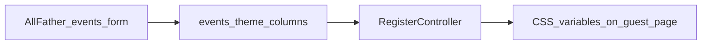

- [x] Migration [`migrations/011_event_theme.sql`](migrations/011_event_theme.sql), wired in [`Database::runMigrations`](src/Services/Database.php) like `009` (add columns only if missing; no new foreign keys — production tables are MyISAM):
  - `theme_primary` CHAR(7) NULL (`#RRGGBB`)
  - `theme_accent` CHAR(7) NULL
  - `welcome_text` VARCHAR(180) NULL
  - `logo_path` VARCHAR(255) NULL
  - `banner_path` VARCHAR(255) NULL
- [x] Store files under `storage/event-branding/{eventId}/`. Serve through a PHP route (same pattern as QR), not a public upload folder.
- [x] **Appearance** block on [`views/admin_events.php`](views/admin_events.php), All Father only. New POST `admin_event_theme` on [`AdminEventsController`](src/Controllers/AdminEventsController.php):
  - Hex colors only
  - Welcome text plain, max 180 characters
  - Logo/banner: png, jpeg, or webp, about 1 MB max
  - Clear controls to drop images and revert to navy
- [x] [`RegisterController`](src/Controllers/RegisterController.php) passes the theme into register, success, and the error flash path.
- [x] [`guest_head.php`](views/partials/guest_head.php) sets `--brand-primary`, `--brand-primary-dark`, `--brand-accent`, and `--guest-hero-gradient` on `.guest-page` when a theme exists.
- [x] [`guest_nav.php`](views/partials/guest_nav.php) shows the logo beside the event name. [`guest_hero.php`](views/partials/guest_hero.php) uses `welcome_text` when set. Banner sits in the hero only.
- [x] Check: unthemed event still looks like today; themed event shares colors on register, success, and error; bad color or non-image upload is rejected; phone and desktop for one themed event and one default event.

No new frontend stack. Keep `?r=register&e={slug}`.

### Plan#3 — VPS go-live

Target: `https://digitalhero.dictr2.cloud`.

- SSH: `dghero111@187.77.150.203` → `/home/digitalhero/htdocs/digitalhero.dictr2.cloud`
- `.env` from [`.env.vps`](.env.vps); `DB_AUTO_MIGRATE=false`; `APP_DEBUG=false`
- Seed username **`allfather`** (password given once in chat, not stored here)

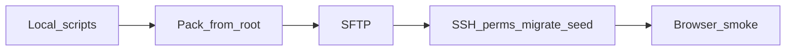

- [x] Run `php scripts/test_rbac_matrix.php` and `php scripts/test_csrf_lifecycle.php`
- [x] Pack from **project root**; exclude one-off scripts, TODO folders, `.git`, and `.env`
- [x] Upload as `dghero111` to `/home/digitalhero/htdocs/digitalhero.dictr2.cloud` (storage QR/signatures kept)
- [x] `.env` from `.env.vps`; production `.htaccess` present
- [x] Permissions `755`/`644`/`.env` `600`, `storage/` writable
- [x] Migrations: `event_assignments` created as MyISAM (no FK to MyISAM `admins`); `php scripts/run_migrations.php` succeeded; `DB_AUTO_MIGRATE=false`
- [x] `php scripts/seed_admin.php allfather` (upsert)
- [x] No `diagnose.php` on docroot
- [x] Browser: `/?r=register` event picker (DICT AI ROADSHOW 2026); `/?r=admin_login` HTTP 200. Sign-in as `allfather` and QR email still for operator to confirm
- [x] [`TODODEPLOYMENT/SERVER_INFO.md`](TODODEPLOYMENT/SERVER_INFO.md) SSH user/path/DB source updated (no secrets)
- [ ] Operator: log in as `allfather`, scan/attendance, SEO, send a test QR email

Remote backups:
- `/home/dghero111/tmp/pred-site-bak-20260921-145717.tgz` (cutover)
- `/home/dghero111/tmp/prod-backup-20260922/` (`app-code.tgz` + `db.sql`, 2026-09-22 full sync; `.env` left on the live app only)

### Later — not this cutover

- [ ] Offline scanner PWA (service worker + IndexedDB queue)
- [ ] Redis rate limiter (MySQL limiter already works)
- [ ] SSE KPI (reverted; polling stays)
- [ ] Add to Wallet, dark mode, EN/Fil, draft storage, QR brightness
- [ ] `must_change_password`, pretty URLs `/e/slug/register`, SSO, people directory

### Explicitly not a leftover

[`diagnose.php`](diagnose.php) / [`create_admin.php`](create_admin.php) read `APP_DEBUG` before `.env` load. CLI still works. Do not “fix” unless we change the gate.

---

## Done (do not rebuild)

- [x] Branch `attendance_accend` created and pushed
- [x] Multi-event draft (`c619ef0`) + finish commit (`3d1ec25`) + leftover close (`a7755d1`)
- [x] `009` + `010` migrations, [`EventContext`](src/Services/EventContext.php), backfill
- [x] Unique links `e=slug`, public picker, All Father copy buttons
- [x] `event_admin` links page [`admin_event_links`](views/admin_event_links.php)
- [x] Event switcher + scoped registrants/attendance/import/export/report/gallery/SEO
- [x] Schedule window in `isPublicOpen()` (status + `starts_at` / `ends_at`)
- [x] Event Save keeps schedule fields
- [x] Router `event:` guard fails closed
- [x] Participant lookup requires `e` (or kiosk `scan_event_id`)
- [x] Controller tests: `event_admin` matrix, cross-event submit, lookup without `e`, schedule window, hard-deny forced context
- [x] SEO and attendance queries scoped with `event_id = ?` only (no `IS NULL` bleed)
- [x] Guest restyle: Public Sans + federal navy (`#1a4480` / `#162e51`), flat surfaces, solid navbar
- [x] One auth helper [`ResolvesEventContext`](src/Controllers/Concerns/ResolvesEventContext.php) on event-scoped admin controllers, including Import (`use` the trait) and export page
- [x] Hard-deny: `currentEvent()` returns null for an unassigned session event (no silent remap)

---

## What is shipped (do not rewrite)

| Area | Where |
|------|--------|
| Migrations | [`migrations/009_multi_event.sql`](migrations/009_multi_event.sql), [`migrations/010_multi_event_hardening.sql`](migrations/010_multi_event_hardening.sql) |
| Event resolver | [`src/Services/EventContext.php`](src/Services/EventContext.php) |
| Auth gate | [`src/Controllers/Concerns/ResolvesEventContext.php`](src/Controllers/Concerns/ResolvesEventContext.php) |
| Public flows | Register / scan / attendance + [`views/public_event_picker.php`](views/public_event_picker.php) |
| Guards | [`config/routes.php`](config/routes.php) `event:…`, [`Router.php`](src/Core/Router.php) fail-closed |
| All Father events | [`AdminEventsController`](src/Controllers/AdminEventsController.php), [`views/admin_events.php`](views/admin_events.php) |
| Event admin links | [`views/admin_event_links.php`](views/admin_event_links.php) |
| Switcher | [`views/partials/admin_nav.php`](views/partials/admin_nav.php) |
| Tests | [`scripts/test_rbac_matrix.php`](scripts/test_rbac_matrix.php); [`scripts/test_csrf_lifecycle.php`](scripts/test_csrf_lifecycle.php) (rotation + replay fail; `submitJsonForTest`/`replaceJsonForTest`/`addNewJsonForTest` also rotate) |
| `.env` merge | [`SettingsController::save`](src/Controllers/SettingsController.php) preserves unknown keys; SMTP keys updated in place |
| Bootstrap gating | [`diagnose.php`](diagnose.php), [`create_admin.php`](create_admin.php) — CLI or `APP_DEBUG`+localhost (gate runs before `.env` load) |

Roles: All Father = `admins.role = admin`. Per-event `event_admin` / `checker` / `seo_viewer` live on `event_assignments`. Settings, users, logs stay All Father only.

Public links: `/?r=register&e={slug}`, `/?r=scan&e={slug}`.

Also already shipped (do not rebuild): RBAC [`AuthService`](src/Services/AuthService.php), guest registration redesign, MySQL rate limiter + admin lockout.

---

## Remaining issues (closed — history)

Open work is only in **Left to do**. Below is shipped Phase 1–3. Stay on `attendance_accend`. Keep `?r=` routes. Design read: Public Sans + federal navy; do not revert to Inter or `#5c6cf2`.

### Closed leftovers (2026-09-21 afternoon)

Independent re-check after the morning pass. **All closed this pass.**

- [x] **Guest Scan must keep `e=`.** [`views/partials/guest_nav.php`](views/partials/guest_nav.php) Scan link now uses `$navSlugForBrand`: `?r=scan&e={slug}` when present, else `?r=scan` (picker).
- [x] **Login brand.** [`views/admin_login.php`](views/admin_login.php) now shows the generic "Event Attendance - Admin" label; no event name is implied.
- [x] **Register flash on CSRF / missing event.** [`RegisterController::submit`](src/Controllers/RegisterController.php) routes every failure (CSRF, missing/closed event, rate limit, 422, duplicate, 500) through one `flashRegisterError()` helper with the same flash shape (`slug` + `fields` + `error`); the error page keeps the retry `e=` link. Browser-verified: stale-token submit keeps typed fields and event on Try again.
- [x] **CSRF test is helper-only.** [`scripts/test_csrf_lifecycle.php`](scripts/test_csrf_lifecycle.php) now also submits through [`AttendanceController::submitJsonForTest`](src/Controllers/AttendanceController.php): success rotates the token and a replay with the same token returns `csrf` (10/10).
- [x] **Stale Hostinger docs.** Root [`CHECKLIST.md`](CHECKLIST.md) and [`MIGRATION_SUMMARY.md`](MIGRATION_SUMMARY.md) now say **digitalhero.dictr2.cloud**, `noreply@digitalhero.dictr2.cloud`, and pack-from-root like [`DEPLOYMENT.md`](DEPLOYMENT.md).

### Phase 1 — Production hardening (must ship)

- [x] **Stop Settings from wiping `.env` (critical).** [`SettingsController::save`](src/Controllers/SettingsController.php) reads existing `.env`, updates SMTP keys in place (password only if submitted), keeps comments and unknown keys. Uses `AuthService::check()`. No dedicated merge unit test was added (only CSRF helper tests).
- [x] **Gate bootstrap-dangerous scripts.** [`diagnose.php`](diagnose.php) and [`create_admin.php`](create_admin.php) exit unless CLI **or** `APP_DEBUG` + localhost. Note: gate uses `getenv('APP_DEBUG')` **before** bootstrap/`.env` load, so local web access may still 403 unless `APP_DEBUG` is in the process environment.
- [x] **CSRF consume-on-success.** `csrf_rotate()` is on register success, settings, events, users, import **preview+execute**, door scan [`AttendanceController::submit`](src/Controllers/AttendanceController.php), admin attendance writes, signature replace/addNew, and test helpers (`submitJsonForTest`, `replaceJsonForTest`, `addNewJsonForTest`). [`scripts/test_csrf_lifecycle.php`](scripts/test_csrf_lifecycle.php) asserts rotation + replay fails (7/7).
- [x] **Dual auth leftovers (controllers).** Settings + AdminSignature **HTTP** paths use `AuthService` / `requireEventContext`. View `admin_id` checks in [`views/scan.php`](views/scan.php) and [`signature.php`](signature.php) remain display-only (intentional).
- [x] **RBAC tests exist.** `php scripts/test_rbac_matrix.php`. [`scripts/test_csrf_lifecycle.php`](scripts/test_csrf_lifecycle.php) covers rotate + `AttendanceController::submitJsonForTest` replay.

### Phase 2 — Product polish (Sep 19 gaps)

- [x] **Event-aware hero/nav.** [`views/register.php`](views/register.php) passes name/date into [`guest_hero.php`](views/partials/guest_hero.php); [`guest_nav.php`](views/partials/guest_nav.php) resolves brand from `$eventName` or `?e=` lookup, [`admin_nav.php`](views/partials/admin_nav.php) shows current event name, [`scan.php`](views/scan.php) uses `$eventName`, titles no longer hardcode `GovNet-Launching` (fallback only).
- [x] **Register error rehydrate.** All submit failures (including CSRF and missing/closed event) go through `flashRegisterError()`; [`register_error.php`](views/register_error.php) keeps flash and `Try again` with `e=`; [`show()`](src/Controllers/RegisterController.php) rehydrates then clears.
- [x] **Safer public default.** [`RegisterController::show()`](src/Controllers/RegisterController.php) shows [`public_event_picker.php`](views/public_event_picker.php) when `e=` is missing (no silent pick).

### Phase 3 — Ops and docs (docs done; live cutover is Left to do)

- [x] [`env.example`](env.example) has `RATE_LIMITER_DRIVER`, `APP_DEBUG`, `DB_AUTO_MIGRATE`.
- [x] Deploy docs aligned: [`DEPLOYMENT.md`](DEPLOYMENT.md), [`QUICK_START.txt`](QUICK_START.txt), [`README.md`](README.md), [`CHECKLIST.md`](CHECKLIST.md), [`MIGRATION_SUMMARY.md`](MIGRATION_SUMMARY.md) use **digitalhero.dictr2.cloud** / pack-from-root.
- [x] [`TODODEPLOYMENT/README.md`](TODODEPLOYMENT/README.md) no longer prefers **`TODODEPLOYMENT/uploads/`** (folder not in repo) — now says pack from project root, `DO_NOT_UPLOAD.txt`. [`TODODEPLOYMENT/CHECKLIST.md`](TODODEPLOYMENT/CHECKLIST.md) says uploads not in repo.
- [x] HTTPS: production template remains [`TODODEPLOYMENT/.htaccess.production`](TODODEPLOYMENT/.htaccess.production); local `.htaccess` can stay HTTP.
- [x] Spec status tables updated: [`TODOMORE`](TODOMORE/future_improvements_spec.md) CSRF now lists door scan + import preview + test helpers with date, rehydrate/nav marked 2026-09-21.

---

## Out of scope

- Pretty paths like `/e/slug/register`
- Shared people directory
- SSO / per-agency tenancy
- Rebuilding EventContext
- New frontend stack or PHPUnit tree conversion
- Committing `.env.vps`, `.env.production`, or storage uploads
