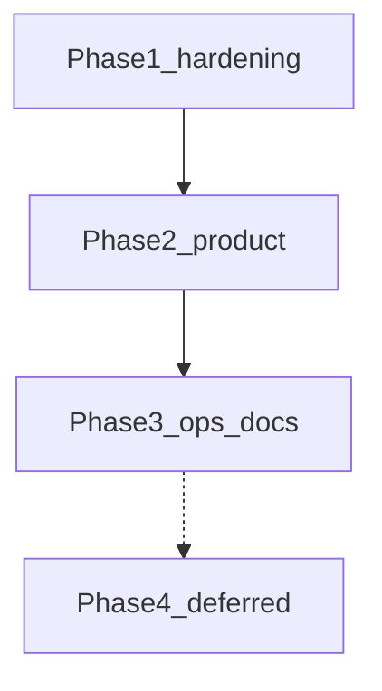

# Multi-event All Father platform

Turn the app into a multi-event platform: All Father creates events, assigns people and roles per event, each event has unique register/scan links, current attendance capabilities stay.

**OpenCode + Muse Spark 13** on branch `attendance_accend`. Enforce [ponytail](https://github.com/dietrichgebert/ponytail) and [taste-skill](https://github.com/leonxlnx/taste-skill) (`design-taste-frontend` + `redesign-existing-projects`).

**Status:** Implemented. Phase 1-3 remaining issues resolved 2026-09-20. Do not rebuild EventContext or the multi-event model.

**Audit:** 2026-09-14 (third pass). Leftovers 1, 2, and 4 were already in `a7755d1`. Leftover 3 is complete after wiring [`ResolvesEventContext`](src/Controllers/Concerns/ResolvesEventContext.php) on Import (was imported but not `use`d) and the export page. Leftovers 5-7 (Settings .env wipe, bootstrap gating, CSRF rotate, dual auth, event-aware hero, register rehydrate, docs) completed 2026-09-20.

---

## Agent: start here

Multi-event is **shipped**. Current leftovers are **Remaining issues (2026-09-20)** below — all Phase 1-3 items have been implemented. Pull `attendance_accend` and keep changes additive. Do not rebuild EventContext.

**Session contract**

1. Branch is `attendance_accend`.
2. Load ponytail (`full`) and taste-skill. Skills live in [`.agents/skills/`](.agents/skills/).
3. Design read before CSS/view changes: public-sector, trust-first. Tokens are already Public Sans + federal navy in [`assets/app.css`](assets/app.css). Do not revert to Inter or `#5c6cf2`.
4. Reuse `EventContext`, `AuthService`, `ResolvesEventContext`, and `?r=` routes.
5. Do not commit `.env`, `.env.vps`, `storage/` uploads, `graphify-out/cache`, or extra skill copies under `.claude/skills/` or `agent/`.

```bash
git checkout attendance_accend
git pull origin attendance_accend
php scripts/test_rbac_matrix.php
php scripts/test_csrf_lifecycle.php
```

---

## Checklist

- [x] Branch `attendance_accend` created and pushed
- [x] Multi-event draft (`c619ef0`) + finish commit (`3d1ec25`) + leftover close (`a7755d1`)
- [x] Ponytail in [`opencode.json`](opencode.json); taste-skill in [`.agents/skills/`](.agents/skills/) + [`skills-lock.json`](skills-lock.json)
- [x] `009` + `010` migrations, [`EventContext`](src/Services/EventContext.php), backfill
- [x] Unique links `e=slug`, public picker, All Father copy buttons
- [x] `event_admin` links page [`admin_event_links`](views/admin_event_links.php)
- [x] Event switcher + scoped registrants/attendance/import/export/report/gallery/SEO
- [x] Schedule window in `isPublicOpen()` (status + `starts_at` / `ends_at`)
- [x] Event Save keeps schedule fields
- [x] Router `event:` guard fails closed
- [x] Participant lookup requires `e` (or kiosk `scan_event_id`)
- [x] Controller tests: `event_admin` matrix, cross-event submit, lookup without `e`, schedule window, hard-deny forced context
- [x] SEO and attendance queries scoped with `event_id = ?` only (no `IS NULL` bleed)
- [x] Taste restyle: Public Sans + federal navy (`#1a4480` / `#162e51`), flat surfaces, solid navbar
- [x] One auth helper [`ResolvesEventContext`](src/Controllers/Concerns/ResolvesEventContext.php) on event-scoped admin controllers, including Import (`use` the trait) and export page
- [x] Hard-deny: `currentEvent()` returns null for an unassigned session event (no silent remap)

---

## What is shipped (do not rewrite)

| Area | Where |
|------|--------|
| Migrations | [`migrations/009_multi_event.sql`](migrations/009_multi_event.sql), [`migrations/010_multi_event_hardening.sql`](migrations/010_multi_event_hardening.sql) |
| Event resolver | [`src/Services/EventContext.php`](src/Services/EventContext.php) |
| Auth gate | [`src/Controllers/Concerns/ResolvesEventContext.php`](src/Controllers/Concerns/ResolvesEventContext.php) |
| Public flows | Register / scan / attendance + [`views/public_event_picker.php`](views/public_event_picker.php) |
| Guards | [`config/routes.php`](config/routes.php) `event:…`, [`Router.php`](src/Core/Router.php) fail-closed |
| All Father events | [`AdminEventsController`](src/Controllers/AdminEventsController.php), [`views/admin_events.php`](views/admin_events.php) |
| Event admin links | [`views/admin_event_links.php`](views/admin_event_links.php) |
| Switcher | [`views/partials/admin_nav.php`](views/partials/admin_nav.php) |
| Tests | [`scripts/test_rbac_matrix.php`](scripts/test_rbac_matrix.php) |
| CSRF lifecycle | [`scripts/test_csrf_lifecycle.php`](scripts/test_csrf_lifecycle.php) — 7 tests |
| `.env` preservation | [`SettingsController::save`](src/Controllers/SettingsController.php) reads existing `.env`, updates only SMTP/DB keys |
| Bootstrap gating | [`diagnose.php`](diagnose.php), [`create_admin.php`](create_admin.php) — CLI or APP_DEBUG+localhost only |
| Event-aware hero | [`views/partials/guest_hero.php`](views/partials/guest_hero.php) binds title/date from EventContext |
| Register rehydrate | [`RegisterController`](src/Controllers/RegisterController.php) + [`views/register_error.php`](views/register_error.php) + [`views/register.php`](views/register.php) |

Roles: All Father = `admins.role = admin`. Per-event `event_admin` / `checker` / `seo_viewer` live on `event_assignments`. Settings, users, logs stay All Father only.

Public links: `/?r=register&e={slug}`, `/?r=scan&e={slug}`.

Also already shipped (do not rebuild): RBAC [`AuthService`](src/Services/AuthService.php), guest registration redesign, MySQL rate limiter + admin lockout.

---

## Remaining issues (2026-09-20)

Phased backlog ordered by blast radius. Do **not** ship PWA, Redis, wallet, dark mode, i18n, and live VPS cutover in one pass. Those stay deferred (Phase 4).

Stay on `attendance_accend`. Keep `?r=` routes. Design read for any view/CSS: public-sector, Public Sans + federal navy in [`assets/app.css`](assets/app.css); do not revert to Inter or `#5c6cf2`. Load ponytail (`full`) and taste-skill before view/CSS work.



### Phase 1 — Production hardening (must ship)

- [x] **Stop Settings from wiping `.env` (critical).** [`SettingsController::save`](src/Controllers/SettingsController.php) now reads existing `.env`, updates only SMTP keys (password only if submitted), preserves comments and unknown keys. Uses `AuthService::check()`.
- [x] **Gate bootstrap-dangerous scripts (critical if uploaded).** [`diagnose.php`](diagnose.php) and [`create_admin.php`](create_admin.php) exit unless CLI **or** `APP_DEBUG` + localhost.
- [x] **CSRF consume-on-success (high).** `csrf_rotate()` called after all successful mutating POSTs (register, settings, attendance writes, import, events, users, signatures). Added `scripts/test_csrf_lifecycle.php` — 7 tests pass: first POST succeeds, replay with same token fails.
- [x] **Dual auth leftovers (medium).** Settings and [`AdminSignatureController`](src/Controllers/AdminSignatureController.php) now use `AuthService::check()` instead of `empty($_SESSION['admin_id'])`.
- [x] **Tests.** `php scripts/test_rbac_matrix.php` — 62 passed, 0 failed. `php scripts/test_csrf_lifecycle.php` — 7 passed, 0 failed.

### Phase 2 — Product polish (Sep 19 gaps)

Load taste-skill before view work.

- [x] **Event-aware hero/nav.** [`views/partials/guest_hero.php`](views/partials/guest_hero.php) now binds title/date from `EventContext`. `register.php` passes event name/date to hero partial.
- [x] **Register error rehydrate.** `RegisterController::submit` flashes posted fields + errors to `$_SESSION['register_flash']`; `register_error.php` reads and clears them; `register.php` repopulates form from `$posted`.
- [x] **Safer public default.** Verified: `RegisterController::show()` already shows `public_event_picker.php` when no `e=` slug is provided; no auto-picking occurs.

Browser-verify: register → error retry keeps fields; two-event hero shows the selected event; register/scan/admin still use `e=`.

### Phase 3 — Ops and docs (no live VPS cutover)

VPS go-live stays out of this track until SMTP and server access are explicit. This phase only makes the repo honest.

- [x] Align root [`README.md`](README.md) / [`DEPLOYMENT.md`](DEPLOYMENT.md) / [`env.example`](env.example) with [`TODODEPLOYMENT/`](TODODEPLOYMENT/) (`digitalhero.dictr2.cloud`; missing knobs: `RATE_LIMITER_DRIVER`, `APP_DEBUG`, `DB_AUTO_MIGRATE`). Added to `env.example`.
- [x] Document: use [`TODODEPLOYMENT/.htaccess.production`](TODODEPLOYMENT/.htaccess.production) on the server (HTTPS); local `.htaccess` can stay HTTP for XAMPP. Documented in DEPLOYMENT.md and TODODEPLOYMENT/README.md.
- [x] Note that `TODODEPLOYMENT/uploads/` is missing — pack from repo root with the existing DO_NOT_UPLOAD list, not a phantom folder. Updated CHECKLIST.md and README.md.
- [x] Update [`TODODEPLOYMENT/CHECKLIST.md`](TODODEPLOYMENT/CHECKLIST.md) as a runbook, not as "we deployed." Updated.
- [x] Update status tables in [`TODOMORE/future_improvements_spec.md`](TODOMORE/future_improvements_spec.md) and [`TODOUI/guest_registration_ui_spec.md`](TODOUI/guest_registration_ui_spec.md) so checklists match reality. Updated both.

### Phase 4 — Explicit deferrals (document, do not implement now)

| Item | Why defer |
|------|-----------|
| Offline scanner PWA | New architecture (SW + IndexedDB + sync); venue-critical later |
| Redis rate limiter | MySQL limiter already shipped |
| SSE KPI | Reverted for PHP session locks |
| Add to Wallet, dark mode, EN/Fil, draft storage, QR brightness | Guest spec post-MVP |
| `must_change_password`, pretty URLs, SSO, people directory | Spec / original out of scope |
| Full VPS cutover | Needs SMTP mailbox + SSH on 187.77.150.203 |

---

## Out of scope

- Pretty paths like `/e/slug/register`
- Shared people directory
- SSO / per-agency tenancy
- Live VPS deploy / cutover
- Rebuilding EventContext
- New frontend stack or PHPUnit tree conversion
- Committing `.env.vps`, storage uploads, `graphify-out/cache`, or duplicate skill folders (`.claude/skills/`, `agent/`)

After code changes: `graphify update .`.
