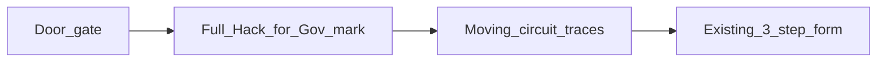
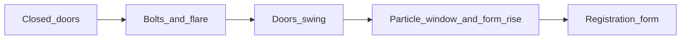
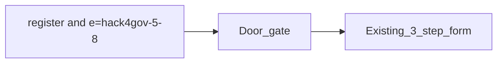
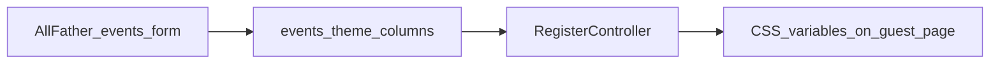
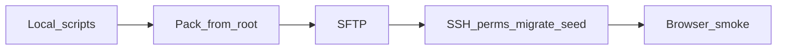

# Multi-event All Father platform

Turn the app into a multi-event platform: All Father creates events, assigns people and roles per event, each event has unique register/scan links, current attendance capabilities stay.

**OpenCode + Muse Spark 13** on branch `attendance_accend`. Enforce [ponytail](https://github.com/dietrichgebert/ponytail) and [taste-skill](https://github.com/leonxlnx/taste-skill) (`design-taste-frontend` + `redesign-existing-projects`).

**Status:** Multi-event is shipped. VPS is live. **Plan#4** and **Plan#5** are done. **Plan#6** is done locally (deploy still open). **Current work is Plan#7** (Hack for Gov mark and circuits on the registration page). Next new plan after that is **Plan#8**.

**Audit:** 2026-09-14 closed multi-event leftovers. 2026-09-20 landed Settings merge, script gating, AuthService, flash plumbing, `env.example`. 2026-09-21 morning pass fixed door-scan CSRF, import-preview rotate, retry `e=` link, event-aware nav, main deploy docs. Same-day afternoon pass closed the five re-check nits (below).

---

## Agent: start here

Multi-event is **shipped**. VPS cutover **ran 2026-09-21**. **Plan#4** and **Plan#5** are live. **Plan#6** is local only until its deploy box is checked. Current work is **Plan#7**. The next plan after that is **Plan#8**. Do not rebuild EventContext. Do not commit `.env` / `.env.vps`.

**Plan numbers**

| ID | Plan | State |
|----|------|--------|
| Plan#1 | Multi-event All Father | Done |
| Plan#2 | Production hardening, guest polish, deploy docs | Done |
| Plan#3 | VPS go-live | Live; operator smoke still open |
| Plan#4 | Per-event registration branding | Done (code + browser-verified 2026-09-22) |
| Plan#5 | Hack for Gov 5 door gate | Live on digitalhero.dictr2.cloud |
| Plan#6 | Door reveal and window particles | Done locally; three-file deploy pending access |
| Plan#7 | Hack for Gov mark and circuits on the form | Done locally; hero + gate assets deploy pending access |

**Session contract**

1. Branch is `attendance_accend`.
2. Load ponytail (`full`) and taste-skill. Skills live in [`.agents/skills/`](.agents/skills/).
3. Design read before CSS/view changes: public-sector, trust-first. Tokens are already Public Sans + federal navy in [`assets/app.css`](assets/app.css). Do not revert to Inter or `#5c6cf2`.
4. Reuse `EventContext`, `AuthService`, `ResolvesEventContext`, and `?r=` routes.
5. Do not commit `.env`, `.env.vps`, `storage/` uploads, `graphify-out/cache`, or extra skill copies under `.claude/skills/` or `agent/`.

```bash
git checkout attendance_accend
git pull origin attendance_accend
php scripts/test_rbac_matrix.php
php scripts/test_csrf_lifecycle.php
```

---

## Left to do

### Plan#7 — Hack for Gov mark and moving circuits on the registration page

Reading this as: the Hack for Gov 5 registration form for event guests, with the existing flag-block mark, leaning toward navy `#0B1B45`, gold `#FCD116`, blue `#0038A8`, and red `#CE1126` — the full logo on the form, with circuit traces that travel and answer the pointer.

The door already splits [assets/hack4gov-door-logo.png](assets/hack4gov-door-logo.png). The form behind it does not. [views/partials/guest_hero.php](views/partials/guest_hero.php) still shows the generic “G” icon on phones and a text panel on desktop. The logo file is a raster, so the circuit lines inside the letters cannot be animated from the PNG. Draw a separate circuit layer over and around the mark.

Only when `theme_layout` is `gate`. Other events keep the current hero. No new library, no migration, no change to field names, CSRF, or `?r=register&e=`. Reuse the same PNG the door uses. `prefers-reduced-motion` shows the logo and still traces. The circuit layer does not sit on top of inputs.



- [x] On the gate register page, show the full `hack4gov-door-logo.png` in the hero in [views/partials/guest_hero.php](views/partials/guest_hero.php): above the title on desktop, and in place of the generic mobile icon. Alt text is the event name. The image scales inside the hero and does not cover the form.
- [x] Add an inline SVG circuit field in that hero: traces and nodes in gold, blue, and red, using the same palette as the logo. A dash animation runs along the traces so the graphic reads as live circuitry. Scope the CSS under a gate-only class in [assets/hack4gov-gate.css](assets/hack4gov-gate.css), which already loads only for this layout.
- [x] In [assets/hack4gov-gate.js](assets/hack4gov-gate.js), the pointer and touch brighten the nearest traces and nodes. The layer is `pointer-events: none` except for that listener on the hero, so typing and the stepper stay usable. Cap the trace count on narrow screens.
- [x] Reduced motion: the logo and traces stay painted, with no traveling dash and no pointer chase.
- [x] Session skip, validation error, and Try again still reach this same form, so the mark and circuits show there too. A second event’s register link has no Hack for Gov image and no circuit SVG.
- [x] Phone width: the mark sits in the hero, the form remains the page, and circuits stay behind the card.
- [ ] After it works locally, deploy the hero partial plus the gate CSS and JS to `/home/digitalhero/htdocs/digitalhero.dictr2.cloud`. No migration and no `.env` change.

Leave alone: the door’s split use of the same PNG, `theme_layout`, slug `hack4gov-5-8`, and the 3-step fields.

### Plan#6 — richer door, reveal into registration, window particles

Reading this as: a public-sector event entrance for Hack for Gov 5 guests, with the existing vault-door language, leaning toward flag navy `#0B1B45`, gold `#FCD116`, and red `#CE1126` — richer light and a pointer-reactive particle field in the opening, not a new visual system.

The live gate looks pale because [assets/hack4gov-gate.css](assets/hack4gov-gate.css) paints a 50% black vignette (`.event-gate-face::after`) over the full-color logo. After unlock, the doors swing and then `.event-gate.done` sets `visibility: hidden` at 2100ms, so the registration page pops in with no handoff. There is no window and no particle field.

Stay inside the gate files. No new library, no migration, no change to field names, CSRF, or `?r=register&e=`. Other events stay door-free. `prefers-reduced-motion` keeps the short slide and shows a still particle field (no drift, no pointer chase). Without JS the gate stays hidden, as it does now.



- [x] Lift the vignette off the logo so the flag blocks stay saturated. Keep a thin gold inner frame and a deeper navy face around the logo, not a gray wash across it.
- [x] Strengthen the seam, bolts, and seal so the unlock reads as metal and light: gold glow on the seam, bolts retract, flare, then the doors swing. Same timing family as today (bolts, then swing). Do not add a second animation library.
- [x] Add a window layer behind the doors in [views/partials/guest_gate.php](views/partials/guest_gate.php): a canvas (or one lightweight particle layer) scoped under `.event-gate`. Particles are small gold, white, and a few blue/red specks. They drift, and the pointer (and touch) nudges nearby particles. The Access System button and keyboard Enter stay on top and clickable. Cap the count on narrow screens.
- [x] Stage the handoff in [assets/hack4gov-gate.js](assets/hack4gov-gate.js) and the CSS: doors finish open, the particle window is visible in the gap, the registration page fades and rises into place, then the gate overlay fades out and scroll unlocks. Remove the hard `visibility` cut. Focus still moves to `first_name` after the reveal.
- [x] Reduced motion: doors slide and fade, particles stay still, the form fades in. No 3D swing and no pointer-driven motion.
- [x] Session skip, validation error, and Try again still skip the gate. A second event’s register link still has no door, no canvas, and no particle script.
- [x] Phone width: doors still cover the screen; particles stay behind the button; the form is usable after the reveal.
- [ ] After it works locally, deploy the three gate files to `/home/digitalhero/htdocs/digitalhero.dictr2.cloud`. No migration and no `.env` change.

Leave alone: the extracted logo file, `theme_layout`, slug `hack4gov-5-8`, and the 3-step form behind the door.

### Plan#5 — Hack for Gov 5 door gate

The sample in [Reference/hack4gov-login.html](Reference/hack4gov-login.html) is a **login mock** with a full-screen door. It is not a registration form. Use the door (split logo, gold seam, bolts, seal, “Access System”) as the entrance, then show the existing 3-step register form. Do not copy the 700KB HTML or its inline base64 into the app.

Existing event is **HACK4GOV 5**, slug `hack4gov-5-8`. Rename the display name to **Hack for Gov 5**. Keep the slug so current links still work.



- [x] Extract door CSS (navy `#0B1B45`, gold `#FCD116`, red `#CE1126`, 3D open, reduced-motion slide) into [assets/hack4gov-gate.css](assets/hack4gov-gate.css). Scope it so admin pages and other events stay unchanged.
- [x] Extract the door logo **once** (both doors use the same image, split with `background-position`) into `assets/hack4gov-door-logo.png`.
- [x] Add [views/partials/guest_gate.php](views/partials/guest_gate.php) and [assets/hack4gov-gate.js](assets/hack4gov-gate.js). Unlock opens the doors, then reveals the form. `prefers-reduced-motion` uses the simpler slide. Skip the gate for the rest of the browser session, and on validation error / Try again.
- [x] Add `events.theme_layout` (`default` or `gate`) in `migrations/012_event_gate.sql`, wired like [011_event_theme.sql](migrations/011_event_theme.sql). Set `gate` on `hack4gov-5-8` only. [RegisterController](src/Controllers/RegisterController.php) passes that into [guest_head.php](views/partials/guest_head.php).
- [x] Optional Plan#4 colors (accent set to #8A6D00, a darkened gold, so small text on white keeps WCAG AA; the door itself uses the flag gold #FCD116) for this event: primary navy, accent gold, so the form behind the door matches. The door is the layout, not a banner image.
- [x] `/?r=register&e=hack4gov-5-8` shows closed doors, then the Hack for Gov 5 form after unlock.
- [x] Reload after unlock does not trap the guest behind the door again.
- [x] Another event’s register link has no door.
- [x] Phone width: doors cover the screen; the form is usable after open.
- [x] After it works locally, deploy to `/home/digitalhero/htdocs/digitalhero.dictr2.cloud` and set that event’s name and `theme_layout`. Deployed 2026-09-22: event 8 is **Hack for Gov 5**, slug `hack4gov-5-8`, `theme_layout=gate`.

Leave alone: field names, CSRF, `?r=register&e=`, other events, and the sample username/password form. Do not commit the raw Reference HTML; ship the extracted logo and CSS.

### Plan#4 — per-event registration branding (implemented)

Code check 2026-09-22: migration `011`, Appearance form, `admin_event_theme`, branding image route, and guest CSS variables are in the repo. Browser pass re-run 2026-09-22 (themed vs default event at desktop and phone widths; computed CSS variables read in-page: a full theme sets all four variables and paints navbar, buttons, and hero gradient; an accent-only theme overrides the accent while primary and hero stay default navy; branding route returns 200 image/png for logo and banner and 404 for unknown kind or event).

Each event can look like its own registration page. **Structured branding only** — no custom CSS box. All Father sets logo, primary color, accent color, a short welcome line, and an optional banner. Layout, steps, and POST field names stay the same. No branding keeps Public Sans + federal navy in [`assets/app.css`](assets/app.css) and [`assets/guest-registration.css`](assets/guest-registration.css).

Same theme on that event’s guest shell: register, success, and error ([`guest_head.php`](views/partials/guest_head.php), [`guest_nav.php`](views/partials/guest_nav.php), [`guest_hero.php`](views/partials/guest_hero.php)). Scan keeps the event name; navbar color follows the same variables when `e=` is set.



- [x] Migration [`migrations/011_event_theme.sql`](migrations/011_event_theme.sql), wired in [`Database::runMigrations`](src/Services/Database.php) like `009` (add columns only if missing; no new foreign keys — production tables are MyISAM):
  - `theme_primary` CHAR(7) NULL (`#RRGGBB`)
  - `theme_accent` CHAR(7) NULL
  - `welcome_text` VARCHAR(180) NULL
  - `logo_path` VARCHAR(255) NULL
  - `banner_path` VARCHAR(255) NULL
- [x] Store files under `storage/event-branding/{eventId}/`. Serve through a PHP route (same pattern as QR), not a public upload folder.
- [x] **Appearance** block on [`views/admin_events.php`](views/admin_events.php), All Father only. New POST `admin_event_theme` on [`AdminEventsController`](src/Controllers/AdminEventsController.php):
  - Hex colors only
  - Welcome text plain, max 180 characters
  - Logo/banner: png, jpeg, or webp, about 1 MB max
  - Clear controls to drop images and revert to navy
- [x] [`RegisterController`](src/Controllers/RegisterController.php) passes the theme into register, success, and the error flash path.
- [x] [`guest_head.php`](views/partials/guest_head.php) sets `--brand-primary`, `--brand-primary-dark`, `--brand-accent`, and `--guest-hero-gradient` on `.guest-page` when a theme exists.
- [x] [`guest_nav.php`](views/partials/guest_nav.php) shows the logo beside the event name. [`guest_hero.php`](views/partials/guest_hero.php) uses `welcome_text` when set. Banner sits in the hero only.
- [x] Check: unthemed event still looks like today; themed event shares colors on register, success, and error; bad color or non-image upload is rejected; phone and desktop for one themed event and one default event.

No new frontend stack. Keep `?r=register&e={slug}`.

### Plan#3 — VPS go-live

Target: `https://digitalhero.dictr2.cloud`.

- SSH: `dghero111@187.77.150.203` → `/home/digitalhero/htdocs/digitalhero.dictr2.cloud`
- `.env` from [`.env.vps`](.env.vps); `DB_AUTO_MIGRATE=false`; `APP_DEBUG=false`
- Seed username **`allfather`** (password given once in chat, not stored here)



- [x] Run `php scripts/test_rbac_matrix.php` and `php scripts/test_csrf_lifecycle.php`
- [x] Pack from **project root**; exclude `diagnose.php`, `create_admin.php`, `TODO*`, `graphify-out`, `.git`, `.env`
- [x] Upload as `dghero111` to `/home/digitalhero/htdocs/digitalhero.dictr2.cloud` (storage QR/signatures kept)
- [x] `.env` from `.env.vps`; production `.htaccess` present
- [x] Permissions `755`/`644`/`.env` `600`, `storage/` writable
- [x] Migrations: `event_assignments` created as MyISAM (no FK to MyISAM `admins`); `php scripts/run_migrations.php` succeeded; `DB_AUTO_MIGRATE=false`
- [x] `php scripts/seed_admin.php allfather` (upsert)
- [x] No `diagnose.php` on docroot
- [x] Browser: `/?r=register` event picker (DICT AI ROADSHOW 2026); `/?r=admin_login` HTTP 200. Sign-in as `allfather` and QR email still for operator to confirm
- [x] [`TODODEPLOYMENT/SERVER_INFO.md`](TODODEPLOYMENT/SERVER_INFO.md) SSH user/path/DB source updated (no secrets)
- [ ] Operator: log in as `allfather`, scan/attendance, SEO, send a test QR email

Remote backup: `/home/dghero111/tmp/pred-site-bak-20260921-145717.tgz`

### Later — not this cutover

- [ ] Offline scanner PWA (service worker + IndexedDB queue)
- [ ] Redis rate limiter (MySQL limiter already works)
- [ ] SSE KPI (reverted; polling stays)
- [ ] Add to Wallet, dark mode, EN/Fil, draft storage, QR brightness
- [ ] `must_change_password`, pretty URLs `/e/slug/register`, SSO, people directory

### Explicitly not a leftover

[`diagnose.php`](diagnose.php) / [`create_admin.php`](create_admin.php) read `APP_DEBUG` before `.env` load. CLI still works. Do not “fix” unless we change the gate.

---

## Done (do not rebuild)

- [x] Branch `attendance_accend` created and pushed
- [x] Multi-event draft (`c619ef0`) + finish commit (`3d1ec25`) + leftover close (`a7755d1`)
- [x] Ponytail in [`opencode.json`](opencode.json); taste-skill in [`.agents/skills/`](.agents/skills/) + [`skills-lock.json`](skills-lock.json)
- [x] `009` + `010` migrations, [`EventContext`](src/Services/EventContext.php), backfill
- [x] Unique links `e=slug`, public picker, All Father copy buttons
- [x] `event_admin` links page [`admin_event_links`](views/admin_event_links.php)
- [x] Event switcher + scoped registrants/attendance/import/export/report/gallery/SEO
- [x] Schedule window in `isPublicOpen()` (status + `starts_at` / `ends_at`)
- [x] Event Save keeps schedule fields
- [x] Router `event:` guard fails closed
- [x] Participant lookup requires `e` (or kiosk `scan_event_id`)
- [x] Controller tests: `event_admin` matrix, cross-event submit, lookup without `e`, schedule window, hard-deny forced context
- [x] SEO and attendance queries scoped with `event_id = ?` only (no `IS NULL` bleed)
- [x] Taste restyle: Public Sans + federal navy (`#1a4480` / `#162e51`), flat surfaces, solid navbar
- [x] One auth helper [`ResolvesEventContext`](src/Controllers/Concerns/ResolvesEventContext.php) on event-scoped admin controllers, including Import (`use` the trait) and export page
- [x] Hard-deny: `currentEvent()` returns null for an unassigned session event (no silent remap)

---

## What is shipped (do not rewrite)

| Area | Where |
|------|--------|
| Migrations | [`migrations/009_multi_event.sql`](migrations/009_multi_event.sql), [`migrations/010_multi_event_hardening.sql`](migrations/010_multi_event_hardening.sql) |
| Event resolver | [`src/Services/EventContext.php`](src/Services/EventContext.php) |
| Auth gate | [`src/Controllers/Concerns/ResolvesEventContext.php`](src/Controllers/Concerns/ResolvesEventContext.php) |
| Public flows | Register / scan / attendance + [`views/public_event_picker.php`](views/public_event_picker.php) |
| Guards | [`config/routes.php`](config/routes.php) `event:…`, [`Router.php`](src/Core/Router.php) fail-closed |
| All Father events | [`AdminEventsController`](src/Controllers/AdminEventsController.php), [`views/admin_events.php`](views/admin_events.php) |
| Event admin links | [`views/admin_event_links.php`](views/admin_event_links.php) |
| Switcher | [`views/partials/admin_nav.php`](views/partials/admin_nav.php) |
| Tests | [`scripts/test_rbac_matrix.php`](scripts/test_rbac_matrix.php); [`scripts/test_csrf_lifecycle.php`](scripts/test_csrf_lifecycle.php) (rotation + replay fail; `submitJsonForTest`/`replaceJsonForTest`/`addNewJsonForTest` also rotate) |
| `.env` merge | [`SettingsController::save`](src/Controllers/SettingsController.php) preserves unknown keys; SMTP keys updated in place |
| Bootstrap gating | [`diagnose.php`](diagnose.php), [`create_admin.php`](create_admin.php) — CLI or `APP_DEBUG`+localhost (gate runs before `.env` load) |

Roles: All Father = `admins.role = admin`. Per-event `event_admin` / `checker` / `seo_viewer` live on `event_assignments`. Settings, users, logs stay All Father only.

Public links: `/?r=register&e={slug}`, `/?r=scan&e={slug}`.

Also already shipped (do not rebuild): RBAC [`AuthService`](src/Services/AuthService.php), guest registration redesign, MySQL rate limiter + admin lockout.

---

## Remaining issues (closed — history)

Open work is only in **Left to do**. Below is shipped Phase 1–3. Stay on `attendance_accend`. Keep `?r=` routes. Design read: Public Sans + federal navy; do not revert to Inter or `#5c6cf2`.

### Closed leftovers (2026-09-21 afternoon)

Independent re-check after the morning pass. **All closed this pass.**

- [x] **Guest Scan must keep `e=`.** [`views/partials/guest_nav.php`](views/partials/guest_nav.php) Scan link now uses `$navSlugForBrand`: `?r=scan&e={slug}` when present, else `?r=scan` (picker).
- [x] **Login brand.** [`views/admin_login.php`](views/admin_login.php) now shows the generic "Event Attendance - Admin" label; no event name is implied.
- [x] **Register flash on CSRF / missing event.** [`RegisterController::submit`](src/Controllers/RegisterController.php) routes every failure (CSRF, missing/closed event, rate limit, 422, duplicate, 500) through one `flashRegisterError()` helper with the same flash shape (`slug` + `fields` + `error`); the error page keeps the retry `e=` link. Browser-verified: stale-token submit keeps typed fields and event on Try again.
- [x] **CSRF test is helper-only.** [`scripts/test_csrf_lifecycle.php`](scripts/test_csrf_lifecycle.php) now also submits through [`AttendanceController::submitJsonForTest`](src/Controllers/AttendanceController.php): success rotates the token and a replay with the same token returns `csrf` (10/10).
- [x] **Stale Hostinger docs.** Root [`CHECKLIST.md`](CHECKLIST.md) and [`MIGRATION_SUMMARY.md`](MIGRATION_SUMMARY.md) now say **digitalhero.dictr2.cloud**, `noreply@digitalhero.dictr2.cloud`, and pack-from-root like [`DEPLOYMENT.md`](DEPLOYMENT.md).

### Phase 1 — Production hardening (must ship)

- [x] **Stop Settings from wiping `.env` (critical).** [`SettingsController::save`](src/Controllers/SettingsController.php) reads existing `.env`, updates SMTP keys in place (password only if submitted), keeps comments and unknown keys. Uses `AuthService::check()`. No dedicated merge unit test was added (only CSRF helper tests).
- [x] **Gate bootstrap-dangerous scripts.** [`diagnose.php`](diagnose.php) and [`create_admin.php`](create_admin.php) exit unless CLI **or** `APP_DEBUG` + localhost. Note: gate uses `getenv('APP_DEBUG')` **before** bootstrap/`.env` load, so local web access may still 403 unless `APP_DEBUG` is in the process environment.
- [x] **CSRF consume-on-success.** `csrf_rotate()` is on register success, settings, events, users, import **preview+execute**, door scan [`AttendanceController::submit`](src/Controllers/AttendanceController.php), admin attendance writes, signature replace/addNew, and test helpers (`submitJsonForTest`, `replaceJsonForTest`, `addNewJsonForTest`). [`scripts/test_csrf_lifecycle.php`](scripts/test_csrf_lifecycle.php) asserts rotation + replay fails (7/7).
- [x] **Dual auth leftovers (controllers).** Settings + AdminSignature **HTTP** paths use `AuthService` / `requireEventContext`. View `admin_id` checks in [`views/scan.php`](views/scan.php) and [`signature.php`](signature.php) remain display-only (intentional).
- [x] **RBAC tests exist.** `php scripts/test_rbac_matrix.php`. [`scripts/test_csrf_lifecycle.php`](scripts/test_csrf_lifecycle.php) covers rotate + `AttendanceController::submitJsonForTest` replay.

### Phase 2 — Product polish (Sep 19 gaps)

Load taste-skill before view work.

- [x] **Event-aware hero/nav.** [`views/register.php`](views/register.php) passes name/date into [`guest_hero.php`](views/partials/guest_hero.php); [`guest_nav.php`](views/partials/guest_nav.php) resolves brand from `$eventName` or `?e=` lookup, [`admin_nav.php`](views/partials/admin_nav.php) shows current event name, [`scan.php`](views/scan.php) uses `$eventName`, titles no longer hardcode `GovNet-Launching` (fallback only).
- [x] **Register error rehydrate.** All submit failures (including CSRF and missing/closed event) go through `flashRegisterError()`; [`register_error.php`](views/register_error.php) keeps flash and `Try again` with `e=`; [`show()`](src/Controllers/RegisterController.php) rehydrates then clears.
- [x] **Safer public default.** [`RegisterController::show()`](src/Controllers/RegisterController.php) shows [`public_event_picker.php`](views/public_event_picker.php) when `e=` is missing (no silent pick).

### Phase 3 — Ops and docs (docs done; live cutover is Left to do)

- [x] [`env.example`](env.example) has `RATE_LIMITER_DRIVER`, `APP_DEBUG`, `DB_AUTO_MIGRATE`.
- [x] Deploy docs aligned: [`DEPLOYMENT.md`](DEPLOYMENT.md), [`QUICK_START.txt`](QUICK_START.txt), [`README.md`](README.md), [`CHECKLIST.md`](CHECKLIST.md), [`MIGRATION_SUMMARY.md`](MIGRATION_SUMMARY.md) use **digitalhero.dictr2.cloud** / pack-from-root.
- [x] [`TODODEPLOYMENT/README.md`](TODODEPLOYMENT/README.md) no longer prefers **`TODODEPLOYMENT/uploads/`** (folder not in repo) — now says pack from project root, `DO_NOT_UPLOAD.txt`. [`TODODEPLOYMENT/CHECKLIST.md`](TODODEPLOYMENT/CHECKLIST.md) says uploads not in repo.
- [x] HTTPS: production template remains [`TODODEPLOYMENT/.htaccess.production`](TODODEPLOYMENT/.htaccess.production); local `.htaccess` can stay HTTP.
- [x] Spec status tables updated: [`TODOMORE`](TODOMORE/future_improvements_spec.md) CSRF now lists door scan + import preview + test helpers with date, rehydrate/nav marked 2026-09-21.

---

## Out of scope

- Pretty paths like `/e/slug/register`
- Shared people directory
- SSO / per-agency tenancy
- Rebuilding EventContext
- New frontend stack or PHPUnit tree conversion
- Committing `.env.vps`, `.env.production`, storage uploads, `graphify-out/cache`, or duplicate skill folders (`.claude/skills/`, `agent/`)

After code changes: `graphify update .`.
