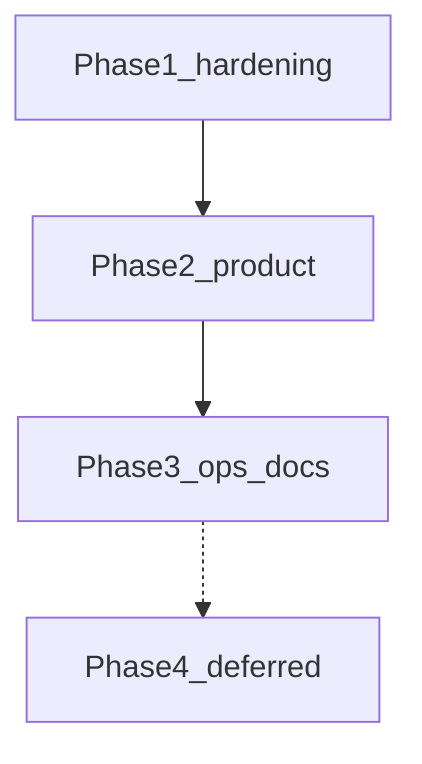

# Multi-event All Father platform

Turn the app into a multi-event platform: All Father creates events, assigns people and roles per event, each event has unique register/scan links, current attendance capabilities stay.

**OpenCode + Muse Spark 13** on branch `attendance_accend`. Enforce [ponytail](https://github.com/dietrichgebert/ponytail) and [taste-skill](https://github.com/leonxlnx/taste-skill) (`design-taste-frontend` + `redesign-existing-projects`).

**Status:** Multi-event is implemented. Do not rebuild EventContext. Phase 1–3 core work is in the repo. The **2026-09-21 afternoon leftovers are closed** (guest scan `e=`, login brand, register flash on CSRF/missing/closed, controller-level CSRF replay test, deploy doc hosts).

**Audit:** 2026-09-14 closed multi-event leftovers. 2026-09-20 landed Settings merge, script gating, AuthService, flash plumbing, `env.example`. 2026-09-21 morning pass fixed door-scan CSRF, import-preview rotate, retry `e=` link, event-aware nav, main deploy docs. Same-day afternoon pass closed the five re-check nits (below).

---

## Agent: start here

Multi-event is **shipped**. Current leftovers are **Open leftovers (2026-09-21)** below — not Phase 4. Pull `attendance_accend` and keep changes additive. Do not rebuild EventContext.

**Session contract**

1. Branch is `attendance_accend`.
2. Load ponytail (`full`) and taste-skill. Skills live in [`.agents/skills/`](.agents/skills/).
3. Design read before CSS/view changes: public-sector, trust-first. Tokens are already Public Sans + federal navy in [`assets/app.css`](assets/app.css). Do not revert to Inter or `#5c6cf2`.
4. Reuse `EventContext`, `AuthService`, `ResolvesEventContext`, and `?r=` routes.
5. Do not commit `.env`, `.env.vps`, `storage/` uploads, `graphify-out/cache`, or extra skill copies under `.claude/skills/` or `agent/`.

```bash
git checkout attendance_accend
git pull origin attendance_accend
php scripts/test_rbac_matrix.php
php scripts/test_csrf_lifecycle.php
```

---

## Checklist

- [x] Branch `attendance_accend` created and pushed
- [x] Multi-event draft (`c619ef0`) + finish commit (`3d1ec25`) + leftover close (`a7755d1`)
- [x] Ponytail in [`opencode.json`](opencode.json); taste-skill in [`.agents/skills/`](.agents/skills/) + [`skills-lock.json`](skills-lock.json)
- [x] `009` + `010` migrations, [`EventContext`](src/Services/EventContext.php), backfill
- [x] Unique links `e=slug`, public picker, All Father copy buttons
- [x] `event_admin` links page [`admin_event_links`](views/admin_event_links.php)
- [x] Event switcher + scoped registrants/attendance/import/export/report/gallery/SEO
- [x] Schedule window in `isPublicOpen()` (status + `starts_at` / `ends_at`)
- [x] Event Save keeps schedule fields
- [x] Router `event:` guard fails closed
- [x] Participant lookup requires `e` (or kiosk `scan_event_id`)
- [x] Controller tests: `event_admin` matrix, cross-event submit, lookup without `e`, schedule window, hard-deny forced context
- [x] SEO and attendance queries scoped with `event_id = ?` only (no `IS NULL` bleed)
- [x] Taste restyle: Public Sans + federal navy (`#1a4480` / `#162e51`), flat surfaces, solid navbar
- [x] One auth helper [`ResolvesEventContext`](src/Controllers/Concerns/ResolvesEventContext.php) on event-scoped admin controllers, including Import (`use` the trait) and export page
- [x] Hard-deny: `currentEvent()` returns null for an unassigned session event (no silent remap)

---

## What is shipped (do not rewrite)

| Area | Where |
|------|--------|
| Migrations | [`migrations/009_multi_event.sql`](migrations/009_multi_event.sql), [`migrations/010_multi_event_hardening.sql`](migrations/010_multi_event_hardening.sql) |
| Event resolver | [`src/Services/EventContext.php`](src/Services/EventContext.php) |
| Auth gate | [`src/Controllers/Concerns/ResolvesEventContext.php`](src/Controllers/Concerns/ResolvesEventContext.php) |
| Public flows | Register / scan / attendance + [`views/public_event_picker.php`](views/public_event_picker.php) |
| Guards | [`config/routes.php`](config/routes.php) `event:…`, [`Router.php`](src/Core/Router.php) fail-closed |
| All Father events | [`AdminEventsController`](src/Controllers/AdminEventsController.php), [`views/admin_events.php`](views/admin_events.php) |
| Event admin links | [`views/admin_event_links.php`](views/admin_event_links.php) |
| Switcher | [`views/partials/admin_nav.php`](views/partials/admin_nav.php) |
| Tests | [`scripts/test_rbac_matrix.php`](scripts/test_rbac_matrix.php); [`scripts/test_csrf_lifecycle.php`](scripts/test_csrf_lifecycle.php) (rotation + replay fail; `submitJsonForTest`/`replaceJsonForTest`/`addNewJsonForTest` also rotate) |
| `.env` merge | [`SettingsController::save`](src/Controllers/SettingsController.php) preserves unknown keys; SMTP keys updated in place |
| Bootstrap gating | [`diagnose.php`](diagnose.php), [`create_admin.php`](create_admin.php) — CLI or `APP_DEBUG`+localhost (gate runs before `.env` load) |

Roles: All Father = `admins.role = admin`. Per-event `event_admin` / `checker` / `seo_viewer` live on `event_assignments`. Settings, users, logs stay All Father only.

Public links: `/?r=register&e={slug}`, `/?r=scan&e={slug}`.

Also already shipped (do not rebuild): RBAC [`AuthService`](src/Services/AuthService.php), guest registration redesign, MySQL rate limiter + admin lockout.

---

## Remaining issues

Phase 1–3 **core** items below are shipped. Stay on `attendance_accend`. Keep `?r=` routes. Design read for any view/CSS: public-sector, Public Sans + federal navy in [`assets/app.css`](assets/app.css); do not revert to Inter or `#5c6cf2`. Load ponytail (`full`) and taste-skill before view/CSS work.

### Open leftovers (2026-09-21 afternoon)

Independent re-check after the morning pass. **All closed this pass.**

- [x] **Guest Scan must keep `e=`.** [`views/partials/guest_nav.php`](views/partials/guest_nav.php) Scan link now uses `$navSlugForBrand`: `?r=scan&e={slug}` when present, else `?r=scan` (picker).
- [x] **Login brand.** [`views/admin_login.php`](views/admin_login.php) now shows the generic "Event Attendance - Admin" label; no event name is implied.
- [x] **Register flash on CSRF / missing event.** [`RegisterController::submit`](src/Controllers/RegisterController.php) routes every failure (CSRF, missing/closed event, rate limit, 422, duplicate, 500) through one `flashRegisterError()` helper with the same flash shape (`slug` + `fields` + `error`); the error page keeps the retry `e=` link. Browser-verified: stale-token submit keeps typed fields and event on Try again.
- [x] **CSRF test is helper-only.** [`scripts/test_csrf_lifecycle.php`](scripts/test_csrf_lifecycle.php) now also submits through [`AttendanceController::submitJsonForTest`](src/Controllers/AttendanceController.php): success rotates the token and a replay with the same token returns `csrf` (10/10).
- [x] **Stale Hostinger docs.** Root [`CHECKLIST.md`](CHECKLIST.md) and [`MIGRATION_SUMMARY.md`](MIGRATION_SUMMARY.md) now say **digitalhero.dictr2.cloud**, `noreply@digitalhero.dictr2.cloud`, and pack-from-root like [`DEPLOYMENT.md`](DEPLOYMENT.md).

Known, **do not treat as a leftover to “fix” unless we change the gate:** [`diagnose.php`](diagnose.php) / [`create_admin.php`](create_admin.php) read `APP_DEBUG` before `.env` load, so local web diagnose may 403. CLI still works.



### Phase 1 — Production hardening (must ship)

- [x] **Stop Settings from wiping `.env` (critical).** [`SettingsController::save`](src/Controllers/SettingsController.php) reads existing `.env`, updates SMTP keys in place (password only if submitted), keeps comments and unknown keys. Uses `AuthService::check()`. No dedicated merge unit test was added (only CSRF helper tests).
- [x] **Gate bootstrap-dangerous scripts.** [`diagnose.php`](diagnose.php) and [`create_admin.php`](create_admin.php) exit unless CLI **or** `APP_DEBUG` + localhost. Note: gate uses `getenv('APP_DEBUG')` **before** bootstrap/`.env` load, so local web access may still 403 unless `APP_DEBUG` is in the process environment.
- [x] **CSRF consume-on-success.** `csrf_rotate()` is on register success, settings, events, users, import **preview+execute**, door scan [`AttendanceController::submit`](src/Controllers/AttendanceController.php), admin attendance writes, signature replace/addNew, and test helpers (`submitJsonForTest`, `replaceJsonForTest`, `addNewJsonForTest`). [`scripts/test_csrf_lifecycle.php`](scripts/test_csrf_lifecycle.php) asserts rotation + replay fails (7/7).
- [x] **Dual auth leftovers (controllers).** Settings + AdminSignature **HTTP** paths use `AuthService` / `requireEventContext`. View `admin_id` checks in [`views/scan.php`](views/scan.php) and [`signature.php`](signature.php) remain display-only (intentional).
- [x] **RBAC tests exist.** `php scripts/test_rbac_matrix.php`. CSRF script exists but is helper-only (see leftovers).

### Phase 2 — Product polish (Sep 19 gaps)

Load taste-skill before view work.

- [x] **Event-aware hero/nav.** [`views/register.php`](views/register.php) passes name/date into [`guest_hero.php`](views/partials/guest_hero.php); [`guest_nav.php`](views/partials/guest_nav.php) resolves brand from `$eventName` or `?e=` lookup, [`admin_nav.php`](views/partials/admin_nav.php) shows current event name, [`scan.php`](views/scan.php) uses `$eventName`, titles no longer hardcode `GovNet-Launching` (fallback only).
- [x] **Register error rehydrate (main path).** Validation / duplicate / rate-limit / 500 flash `slug`+fields; [`register_error.php`](views/register_error.php) keeps flash and links `Try again` to `?r=register&e=slug`; [`show()`](src/Controllers/RegisterController.php) rehydrates then clears. CSRF and missing-event still skip flash (leftover above).
- [x] **Safer public default.** [`RegisterController::show()`](src/Controllers/RegisterController.php) shows [`public_event_picker.php`](views/public_event_picker.php) when `e=` is missing (no silent pick).

Browser-verify after leftovers: guest navbar Scan with `e=` opens that event’s scan (or picker if none); error → Try again keeps fields **and** slug after CSRF/missing-event too.

### Phase 3 — Ops and docs (no live VPS cutover)

- [x] [`env.example`](env.example) has `RATE_LIMITER_DRIVER`, `APP_DEBUG`, `DB_AUTO_MIGRATE`.
- [x] Main deploy docs aligned: [`DEPLOYMENT.md`](DEPLOYMENT.md), [`QUICK_START.txt`](QUICK_START.txt), [`README.md`](README.md). [`CHECKLIST.md`](CHECKLIST.md) / [`MIGRATION_SUMMARY.md`](MIGRATION_SUMMARY.md) still stale (leftover above).
- [x] [`TODODEPLOYMENT/README.md`](TODODEPLOYMENT/README.md) no longer prefers **`TODODEPLOYMENT/uploads/`** (folder not in repo) — now says pack from project root, `DO_NOT_UPLOAD.txt`. [`TODODEPLOYMENT/CHECKLIST.md`](TODODEPLOYMENT/CHECKLIST.md) says uploads not in repo.
- [x] HTTPS: production template remains [`TODODEPLOYMENT/.htaccess.production`](TODODEPLOYMENT/.htaccess.production); local `.htaccess` can stay HTTP.
- [x] Spec status tables updated: [`TODOMORE`](TODOMORE/future_improvements_spec.md) CSRF now lists door scan + import preview + test helpers with date, rehydrate/nav marked 2026-09-21.

### Phase 4 — Explicit deferrals (document, do not implement now)

| Item | Why defer |
|------|-----------|
| Offline scanner PWA | New architecture (SW + IndexedDB + sync); venue-critical later |
| Redis rate limiter | MySQL limiter already shipped |
| SSE KPI | Reverted for PHP session locks |
| Add to Wallet, dark mode, EN/Fil, draft storage, QR brightness | Guest spec post-MVP |
| `must_change_password`, pretty URLs, SSO, people directory | Spec / original out of scope |
| Full VPS cutover | Needs SMTP mailbox + SSH on 187.77.150.203 |

---

## Out of scope

- Pretty paths like `/e/slug/register`
- Shared people directory
- SSO / per-agency tenancy
- Live VPS deploy / cutover
- Rebuilding EventContext
- New frontend stack or PHPUnit tree conversion
- Committing `.env.vps`, storage uploads, `graphify-out/cache`, or duplicate skill folders (`.claude/skills/`, `agent/`)

After code changes: `graphify update .`.
